---
lab:
  title: ラボ 4 –リソースの監視と最適化
  module: Monitor and Optimize Operational Resources
---

# <a name="lab-4--monitor-and-optimize-resources"></a>ラボ 4 –リソースの監視と最適化


**推定時間**:60 分

**前提条件**:ラボ VM、およびラボ 2 と 3 で作成された Azure SQL データベース


# <a name="lab-overview"></a>ラボの概要


The students will take the information gained in the lessons to scope out the deliverables for a digital transformation project within AdventureWorks. Examining the Azure portal as well as other tools, students will determine how to utilize native tools to identify and resolve performance related issues. Finally, students will be able to identify fragmentation within the database as well as learn steps to resolve the issue appropriately. 


# <a name="lab-objectives"></a>ラボの目的


このラボを完了すると、次のことができるようになります。

1. 監視を通じてパフォーマンスの問題を特定します。 

2. クエリ ストアを利用して、新しいインデックスを作成し、ブロッキングの問題を特定して解決する

3. 断片化の問題を検出して修正します。 


# <a name="scenario"></a>シナリオ


You have been hired as a database administrator to identify performance related issues and provide viable solutions to resolve any issues found. AdventureWorks has been selling bicycles and bicycle parts directly to consumers and distributors for over a decade. The company utilizes a mixture of both Azure SQL Databases as well as a SQL Server in an Azure Virtual Machine. Recently the company has noticed performance degradation within both products that are used to service customer requests. You need to use the Azure portal as well as on-premises tools to identify the performance issues and suggest methods to resolve them. 
 
        

<bpt id="p1">**</bpt>Note:<ept id="p1">**</ept> The exercises ask you to copy and paste T-SQL code. Please verify that the code has been copied correctly, with the proper line breaks, before executing the code. 

        

# <a name="exercise-1-isolate-problems-by-monitoring"></a>演習 1:監視によって問題を特定する


予測される所要時間:30 分

この演習の主なタスクは次のとおりです。

1. 監視ソリューションを確認して、Azure SQL データベースのパフォーマンス関連の問題を特定する

2. クエリ ストアを使用して、進行中のブロッキングの問題を特定し、ブロッキングを解決するために実装する適切なインデックスを特定します。 

3. クエリ ツールを使用してインデックスの断片化を識別し、断片化を解決する方法を提供します。 

 

## <a name="task-1-review-cpu-utilization-in-azure-portal"></a>タスク 1:Azure Portal で CPU 使用率を確認する

1. If you're not already in the Azure portal, navigate back to portal.azure.com. You may need to login again. In the search bar at the top of the Azure Portal, type SQL, and click on SQL databases. This task will use the AdventureWorks database you created in Lab 3. Click on the database name.


    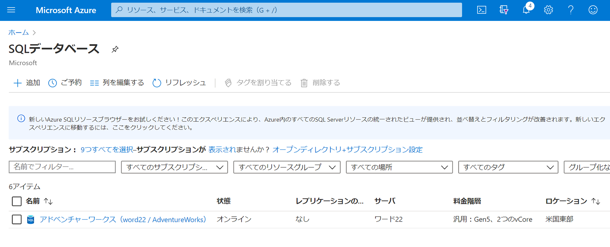


2. AdventureWorks データベース ブレードの [監視] セクションで [メトリック] を見つけて選択します。 


3.  CPU パーセンテージを反映するようにメトリックメニューオプションを変更する

 
    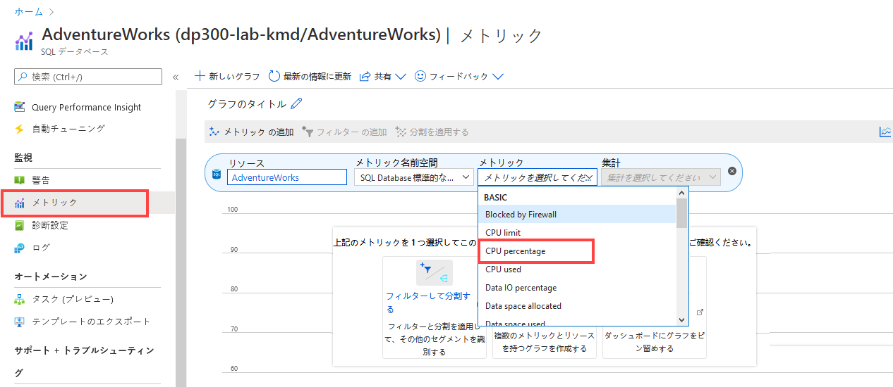

4. Select an Aggregation of “Avg”. This will display the average CPU Percentage for the given time frame. 

5. Now adjust the aggregation to Max to identify the maximum CPU Percentage used for the give time frame. How is it different from the average?

## <a name="task-2-identify-high-cpu-consuming-queries"></a>タスク 2:CPU 使用率の高いクエリを特定する

1. 最初のタスクと同じビューで、インテリジェント パフォーマンスの同じメニューでクエリ パフォーマンスの分析情報を選択します。

    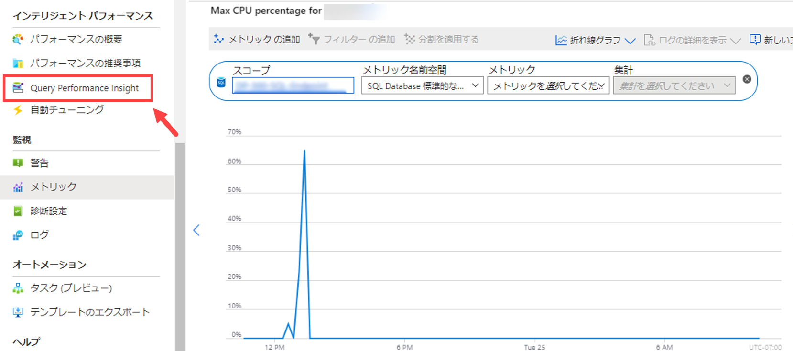

2.  グラフの下のグリッドの最初のクエリをクリックします。 


    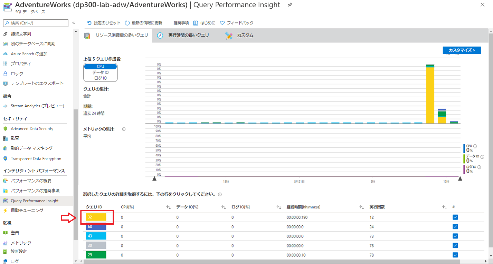

3. 学生は、レッスンで得た情報を利用して、AdventureWorks 内のデジタルトランスフォーメーション プロジェクトの成果物を調べます。

 
    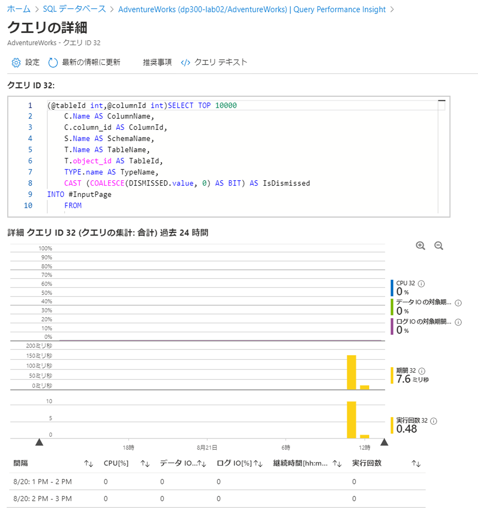


# <a name="exercise-2-identify-and-resolve-blocking-issues"></a>演習 2:ブロッキングの問題を特定して解決する


予測される所要時間:15 分

個別演習

この演習の主なタスクは次のとおりです。

1. 拡張イベントでブロッキング レポートを利用して、ブロッキングを引き起こしているクエリを特定する

2. ブロッキングを解決するために実装できるインデックスを特定する

## <a name="task-1-run-blocked-queries-report"></a>タスク 1:ブロックされたクエリ レポートの実行

この演習では、ラボの VM から SQL Server Management Studio を使用して、オンプレミスの SQL Server に接続します。 

1.  ラボの VM から [スタート] メニューを開き、   
    受講生は、Azure portal と他のツールを調べ、ネイティブ ツールを利用してパフォーマンス関連の問題を特定して解決する方法を決定します。 

2. Management Studio で [新しいクエリ] ボタンをクリックして、新しいクエリを開始します。

    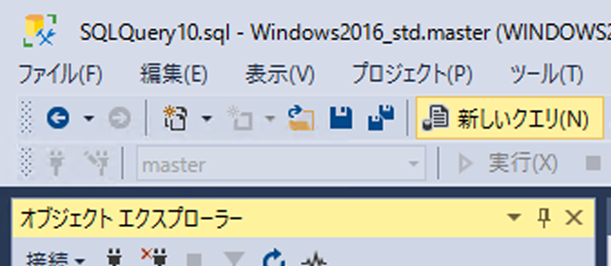

    SQL Server に接続するように求められます。


    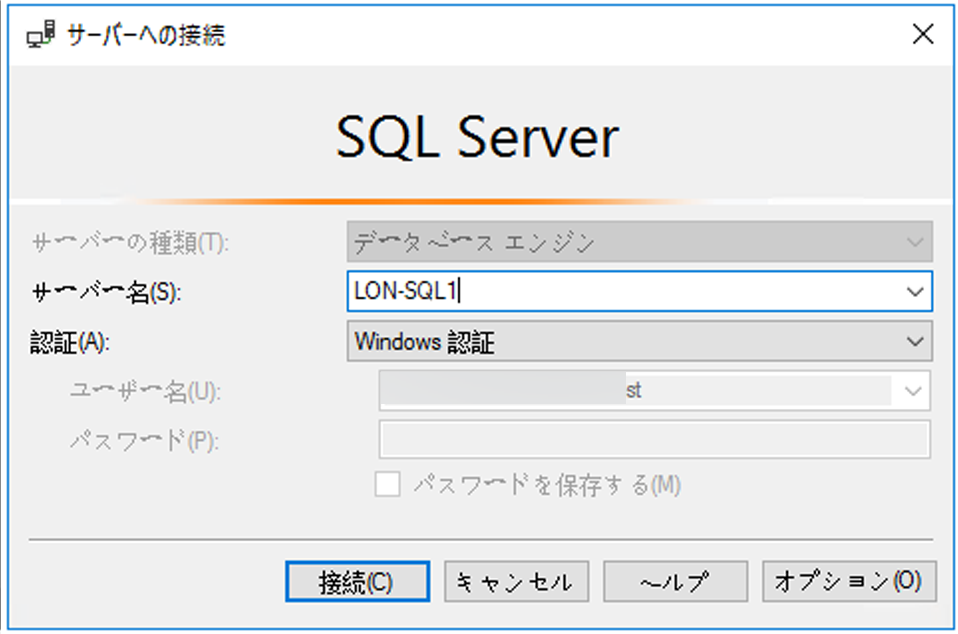

    ローカル サーバー名として LON-SQL1 を入力し、Windows 認証が選択されていることを確認して、[接続]をクリックします。


3. 次のコードをコピーして、クエリ ウィンドウに貼り付けます。 

 
    ```sql
    USE MASTER

    GO

    CREATE EVENT SESSION [Blocking] ON SERVER 

    ADD EVENT sqlserver.blocked_process_report(

    ACTION(sqlserver.client_app_name,sqlserver.client_hostname,sqlserver.database_id,sqlserver.database_name,sqlserver.nt_username,sqlserver.session_id,sqlserver.sql_text,sqlserver.username))

    ADD TARGET package0.ring_buffer

    WITH (MAX_MEMORY=4096 KB, EVENT_RETENTION_MODE=ALLOW_SINGLE_EVENT_LOSS, MAX_DISPATCH_LATENCY=30 SECONDS, MAX_EVENT_SIZE=0 KB,MEMORY_PARTITION_MODE=NONE, TRACK_CAUSALITY=OFF,STARTUP_STATE=ON)

    GO

    -- Start the event session 

    ALTER EVENT SESSION [Blocking] ON SERVER 

    STATE = start; 

    GO
    ```

    実行ボタンをクリックしてこのクエリを実行します。 

    最後に、受講生はデータベース内の断片化を特定し、問題を適切に解決する手順を学ぶことができます。

    - クライアント アプリケーション名

    - クライアント ホスト名

    - データベース ID

    - データベース名

    - NT ユーザー名

    - セッション ID

    - T-SQL テキスト

    - ユーザー名


4. Click New Query from SQL Server Management Studio. Copy and paste the following T-SQL code into the query window. Click the execute button to execute this query. 

    ```sql
    USE AdventureWorks2017

    GO

    BEGIN TRANSACTION

    UPDATE Person.Person SET LastName = LastName;

    GO
    ```
 

5. Open another query window by clicking the New Query button. Copy and paste the following T-SQL code into the query window. Click the execute button to execute this query. 

    ```sql
    USE AdventureWorks2017

    GO

    SELECT TOP (1000) [LastName]

    ,[FirstName]

    ,[Title]

    FROM Person.Person

    WHERE FirstName = 'David'
    ```
    

    このクエリはすぐには結果を返さず、まだ実行中のように見えます。


6. In Object Explorer, navigate to <bpt id="p1">**</bpt>Management<ept id="p1">**</ept>, and expand the hive by clicking the plus sign. Expand <bpt id="p1">**</bpt>Extended Events<ept id="p1">**</ept> and then expand <bpt id="p2">**</bpt>Sessions<ept id="p2">**</ept>. Expand <bpt id="p1">**</bpt>Blocking<ept id="p1">**</ept>, which contains the session created in step 3. Right click on <bpt id="p1">**</bpt>package0.ring_buffer<ept id="p1">**</ept> and select <bpt id="p2">**</bpt>View Target Data<ept id="p2">**</ept>. 

    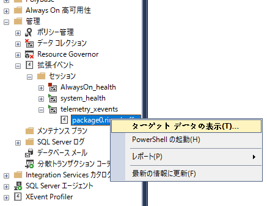

7. ハイパーリンクをクリックします。 

    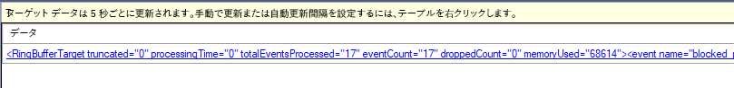

8. この XML では、ブロックされているプロセスと、ブロックの原因となっているプロセスを確認できます。 

    
 
9.  **[ブロック]** という拡張イベント セッションを右クリックし、 **[セッションの停止]** を選択します。 
    
    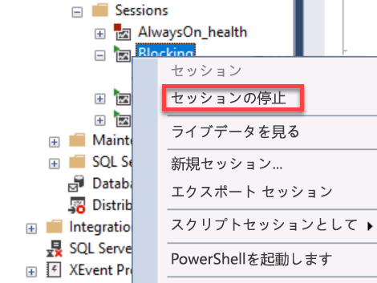

10.  Navigate back to the query tab you opened in step 4, and type ROLLBACK TRANSACTION on the line below the query. Highlight ROLLBACK TRANSACTION and execute the command.

  
 
11. Navigate back to the query tab you opened in Step 5. You will notice that the query has now completed.

12. すべてのクエリ ウィンドウを閉じます。

## <a name="task-2-enabling-read-committed-snapshot-isolation"></a>タスク 2:コミットされたスナップショット分離の読み取りの有効化

1. Open a new query window. Copy and paste the following T-SQL code into the query window. Click the execute button to execute this query. 

```sql
USE master

GO

ALTER DATABASE AdventureWorks2017 SET READ_COMMITTED_SNAPSHOT ON WITH ROLLBACK IMMEDIATE;

GO
```
2. Copy and paste the following T-SQL code into a new query window. Click the execute button to execute this query. 
```sql
USE AdventureWorks2017

GO

BEGIN TRANSACTION

UPDATE Person.Person SET LastName = LastName;

GO
```
 

3. あなたは、パフォーマンス関連の問題を見つけ出して、見つかった問題を解決するための実用的ソリューションを提供するデータベース管理者として雇用されています。 

```sql
USE AdventureWorks2017

GO

SELECT TOP (1000) [LastName]

 ,[FirstName]

 ,[Title]

 FROM Person.Person

 WHERE firstname = 'David';
 
 GO
```

4. AdventureWorks は、10 年以上にわたって自転車と自転車部品を消費者と販売業者に直接販売しています。 


# <a name="exercise-3-detectcorrect-fragmentation-issues"></a>演習 3:フラグメンテーションの問題を検出/修正


予測される所要時間:15 分

個別演習

この演習の主なタスクは次のとおりです。

1. 断片化を識別する 

2. 断片化を取り除く

2. インストラクターは、わかったことについてグループと話し合います。

## <a name="task-1-identify-fragmentation"></a>タスク 1:断片化を識別する

1. 同社は、Azure Virtual Machine で Azure SQL データベースと SQL Server の両方を組み合わせて利用しています。 

```sql
USE AdventureWorks2017
GO

INSERT INTO [Person].[Address]

 ([AddressLine1]

 ,[AddressLine2]

 ,[City]

 ,[StateProvinceID]

 ,[PostalCode]

 ,[SpatialLocation]

 ,[rowguid]

 ,[ModifiedDate])

SELECT AddressLine1,

 AddressLine2, 

 'Amsterdam',

 StateProvinceID, 

 PostalCode, 

 SpatialLocation, 

 newid(), 

 getdate()

FROM Person.Address;


GO
```
このクエリは、Person.Address テーブルとそのインデックスの断片化レベルを上げます。


2. 最近同社は、顧客の依頼に対応するために使用される両方の製品のパフォーマンスの低下に気づきました。 

```sql
USE AdventureWorks2017

GO

SELECT i.name Index_Name

 , avg_fragmentation_in_percent

 , db_name(database_id)

 , i.object_id

 , i.index_id

 , index_type_desc

FROM sys.dm_db_index_physical_stats(db_id('AdventureWorks2017'),object_id('person.address'),NULL,NULL,'DETAILED') ps

 INNER JOIN sys.indexes i ON ps.object_id = i.object_id 

 AND ps.index_id = i.index_id

WHERE avg_fragmentation_in_percent > 50 -- find indexes where fragmentation is greater than 50%
```
 
Azure portalとオンプレミスのツールを使用して、パフォーマンスの問題を特定し、解決方法を提案する必要があります。


3. Copy and paste the following T-SQL code into a new query window. Click the execute button to to execute this query. 

```sql
SET STATISTICS IO,TIME ON

GO

USE AdventureWorks2017

GO

SELECT DISTINCT (StateProvinceID)

 ,count(StateProvinceID) AS CustomerCount

FROM person.Address

GROUP BY StateProvinceID

ORDER BY count(StateProvinceID) DESC;

GO
```
 

**注:**  演習では、T-SQL コードをコピーして貼り付けるように求められます。 
    
   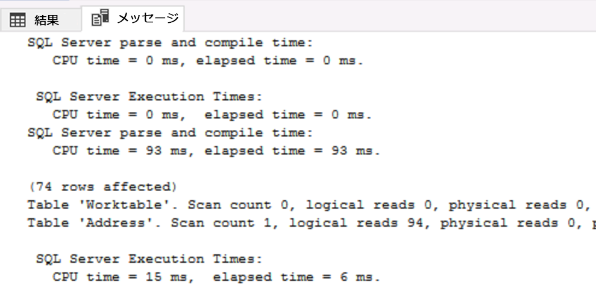

## <a name="task-2-rebuild-indexes"></a>タスク 2:インデックスを再構築する

1. [新しいクエリ] ボタンをクリックします。 


2. コードを実行する前に、コードが正しくコピーされ、改行されていることを確認してください。 

```sql
USE AdventureWorks2017

GO

ALTER INDEX [IX_Address_StateProvinceID] ON [Person].[Address] REBUILD PARTITION = ALL WITH (PAD_INDEX = OFF, STATISTICS_NORECOMPUTE = OFF, SORT_IN_TEMPDB = OFF, IGNORE_DUP_KEY = OFF, ONLINE = OFF, ALLOW_ROW_LOCKS = ON, ALLOW_PAGE_LOCKS = ON)
```
 

3. Re-execute the query from step 2 in Task 1. Confirm that the AK_Address_StateProvinceID index no longer has fragmentation greater than 50%. 

4. Re-execute the query from step 3 in Task 1. Make note of the logical reads in the Messages tab of the Results pane in Management Studio. Was there a change from the number of logical reads encountered before you rebuilt the index? 
