---
lab:
  title: ラボ 5 - クエリ パフォーマンスの問題解決
  module: Optimize Query Performance
ms.openlocfilehash: 614a4f7c7a1d8cce16151e9d0133d59be3d30515
ms.sourcegitcommit: ea479a647efed10ce4bb2ef8af703ac03b7d434d
ms.translationtype: HT
ms.contentlocale: ja-JP
ms.lasthandoff: 03/30/2022
ms.locfileid: "141267288"
---
# <a name="lab-5--query-performance-troubleshooting"></a>ラボ 5 - クエリ パフォーマンスの問題解決

**推定時間**:75 分

**ラボ ファイル**：このラボのファイルは、D:\Labfiles\Query Performance フォルダーにあります。


# <a name="lab-overview"></a>ラボの概要

受講生は、正規化、データ型の選択、およびインデックス設計の問題について、データベース設計を評価します。 準最適なパフォーマンスでクエリを実行し、クエリ プランを調べ、AdventureWorks2017 データベース内で改善を試みます。

# <a name="lab-objectives"></a>ラボの目的

このラボを完了すると、次のことができるようになります。

1. データベース設計の問題を特定する

    - データベース設計のクエリを評価します

    - 既存の設計を調べて、過大または過小な正規化や不適切なデータ型などの潜在的な不良パターンがないか確認します 

2. パフォーマンスが悪いクエリの問題点を特定します 

    - GUI を使用せずにクエリを実行して実際の実行プランを生成します

    - 指定された実行プラン (キー検索など) を評価します 

3. クエリ ストアを使用して機能低下を検出して処理します 

    - ワークロードを実行して、クエリ ストアのクエリ統計を生成します 

    - リソース消費量上位のクエリを調べて低いパフォーマンスを特定する 

    - より適切な実行プランを強制する 

4. クエリ ヒントを使用してパフォーマンスに影響を与えます 

    - ワークロードを実行します 

    - パラメーター値を使用するようにクエリを変更します

    - クエリ ヒントをクエリに適用して値を最適化します 

# <a name="scenario"></a>シナリオ

あなたは、ユーザーが AdventureWorks2017 データベースに対してクエリを実行するときに現在発生しているパフォーマンスの問題に対処するために、シニア データベース管理者として採用されました。 あなたの仕事は、このモジュールで学習した手法を使用して、クエリのパフォーマンスの問題を明らかにし、解決することです。

最初のステップは、ユーザーが問題を抱えているクエリを確認し、推奨事項を作成することです。

1. AdventureWorks2017 内のデータベース設計の問題を特定します

2. AdventureWorks2017 のパフォーマンスの低いクエリの問題領域を特定します

3. クエリ ストアを使用して、AdventureWorks2017 で機能低下を検出して処理します

4. クエリ ヒントを使用して、AdventureWorks2017 のパフォーマンスに影響を与えます
 
        

**注:**  演習では、T-SQL コードをコピーして貼り付けるように求められます。 コードを実行する前に、コードが正しくコピーされ、改行されていることを確認してください。 

       


# <a name="exercise-1-identify-issues-with-database-design-in-adventureworks2017"></a>演習 1:AdventureWorks2017 のデータベース設計の問題を特定します

予測される所要時間:15 分

この演習の主なタスクは、以下の通りです。

1. クエリを調べて、警告が表示される理由とその警告の内容を特定します。

2. 問題を解決する方法が 2 つ見つかります。

    - クエリを修正して問題を解決します。

    - データベースの設計変更を提案して、問題を修正します。

## <a name="task-1-examine-the-query-and-identify-the-problem"></a>タスク 1:クエリを調べて問題を特定します。

1. ラボの仮想マシンで **SQL Server Management Studio (SSMS)** を起動します。 

    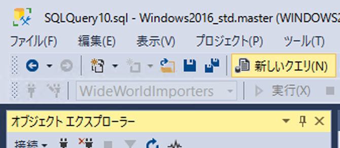

2. SQL Server に接続するように求められます。  
サーバー名「LON-SQL1」を入力し、Windows 認証が選択されていることを確認して、[接続] をクリックします。

    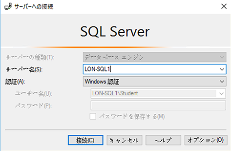

‎   
3. 新しいクエリ ウィンドウを開きます。 次のコードをコピーして、クエリ ウィンドウに貼り付けます。

```sql
USE AdventureWorks2017;

SELECT BusinessEntityID, NationalIDNumber, LoginID, HireDate, JobTitle 

FROM HumanResources.Employee 

WHERE NationalIDNumber = 14417807;
```

4. クエリを実行する前に、次に示すように [実際の実行プランを含める] アイコンをクリックするか、Ctrl + M キーを押します。 これにより、クエリを実行すると実行プランが表示されるようになります。
    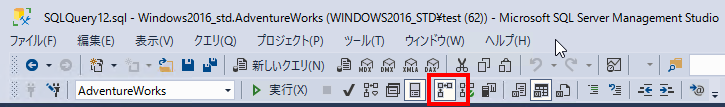  
‎

5. [実行] ボタンをクリックしてこのクエリを実行します。 

6. SSMS の [結果] パネルの [実行プラン] タブをクリックして、実行プランに移動します。 実行プランで、SELECT 演算子の上にマウスを移動します。 次に示すように、感嘆符付きの黄色の三角形で識別される警告メッセージを確認します。 警告メッセージの通知内容を識別します。 
    

    暗黙的な変換がパフォーマンスの問題を引き起こしています。


## <a name="task-2-identify-two-ways-to-fix-the-warning-issue"></a>タスク 2:警告の問題を解決する 2 つの方法を識別する

テーブルの構造は、次のデータ定義言語 (DDL) ステートメントに示されています。

```sql
CREATE TABLE [HumanResources].[Employee](

 [BusinessEntityID] [int] NOT NULL,

 [NationalIDNumber] [nvarchar](15) NOT NULL,

 [LoginID] [nvarchar](256) NOT NULL,

 [OrganizationNode] [hierarchyid] NULL,

 [OrganizationLevel] AS ([OrganizationNode].[GetLevel]()),

 [JobTitle] [nvarchar](50) NOT NULL,

 [BirthDate] [date] NOT NULL,

 [MaritalStatus] [nchar](1) NOT NULL,

 [Gender] [nchar](1) NOT NULL,

 [HireDate] [date] NOT NULL,

 [SalariedFlag] [dbo].[Flag] NOT NULL,

 [VacationHours] [smallint] NOT NULL,

 [SickLeaveHours] [smallint] NOT NULL,

 [CurrentFlag] [dbo].[Flag] NOT NULL,

 [rowguid] [uniqueidentifier] ROWGUIDCOL NOT NULL,

 [ModifiedDate] [datetime] NOT NULL

) ON [PRIMARY]
```


1. コードをソリューションとして使用してクエリを修正します。

暗黙的な変換を引き起こしている列とその理由を特定します。 

タスク 1 からのクエリを確認すると、引用符で囲まれた文字列ではないため、WHERE 句の NationalIDNumber 列と比較された値が数値として入力されていることがわかります。 テーブル構造を調べると、テーブル内のこの列が nvarchar(15) データ型を使用しており、int または整数データ型を使用していないことがわかります。 このデータ型の不一致により、オプティマイザは実行時に定数を nvarchar に暗黙的に変換し、準最適なプランによってクエリのパフォーマンスに追加のオーバーヘッドを引き起こします。

2. 暗黙の変換を解決するようにコードを変更し、クエリを再実行します。 [実際の実行プランを含める] (Ctrl + M) が上記の演習で設定されていない場合は、忘れずに設定してください。 警告が消えたことを確認してください。

NationalIDNumber 列と比較される値がテーブル内の列のデータ型と一致するように WHERE 句を変更すると、暗黙的な変換を取り除くことができます。 このシナリオでは、値の両側に単一引用符を追加するだけで、数値から文字列に変更されます。 このクエリのクエリ ウィンドウを開いたままにしておきます。

```sql
SELECT BusinessEntityID, NationalIDNumber, LoginID, HireDate, JobTitle 

FROM HumanResources.Employee 

WHERE NationalIDNumber = '14417807'
```

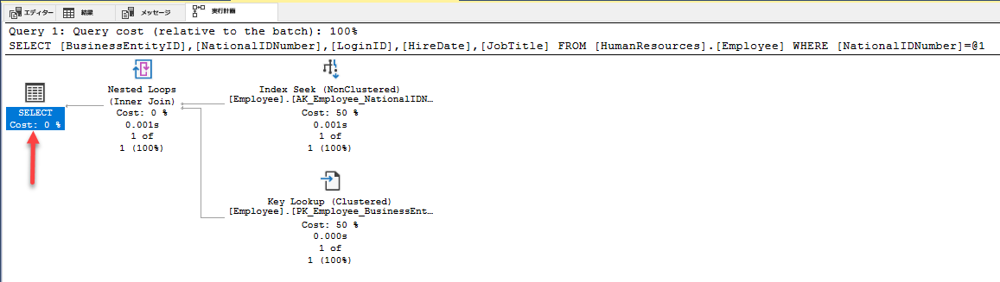


3. データベースの設計の変更を使用してクエリを修正します。 

インデックスを修正するには、新しいクエリ ウィンドウを開き、以下のクエリをコピーして列のデータ型を変更します。 [実行] をクリックしてクエリの実行を試みます。

```sql
ALTER TABLE [HumanResources].[Employee] ALTER COLUMN [NationalIDNumber] INT NOT NULL;
```

テーブルに変更を加えることで、変換の問題は解決します。 ただし、この変更により別の問題が発生するため、データベース管理者として解決する必要があります。 この列は既存の非クラスター化インデックスの一部であるため、データ型を変更するには、インデックスを再構築または再作成する必要があります。 これにより、運用環境でのダウンタイムが長くなる可能性があります。これは、設計で適切なデータ型を選択することの重要性を浮き彫りにするものです。 

Msg 5074, Level 16, State 1, Line 1The index 'AK_Employee_NationalIDNumber' is dependent on column 'NationalIDNumber'.

Msg 4922, Level 16, State 9, Line 1

1 つ以上のオブジェクトがこの列にアクセスするので、ALTER TABLE ALTER COLUMN NationalIDNumber は失敗しました。

 

4. この問題を解決するには、以下のコードをコピーしてクエリ ウィンドウに貼り付け、[実行] をクリックして実行します。

```sql
USE AdventureWorks2017
GO

DROP INDEX [AK_Employee_NationalIDNumber] ON [HumanResources].[Employee]
GO

ALTER TABLE [HumanResources].[Employee] ALTER COLUMN [NationalIDNumber] INT NOT NULL;
GO

CREATE UNIQUE NONCLUSTERED INDEX [AK_Employee_NationalIDNumber] ON [HumanResources].[Employee]

( [NationalIDNumber] ASC

);
GO
```

5. 引用符のない元のクエリを再実行します。

```sql
USE AdventureWorks2017;

SELECT BusinessEntityID, NationalIDNumber, LoginID, HireDate, JobTitle 

FROM HumanResources.Employee 

WHERE NationalIDNumber = 14417807;
```

実行プランに警告メッセージが表示されなくなったことに注意してください。 

# <a name="exercise-2-isolate-problem-areas-in-poorly-performing-queries-in-adventureworks2017"></a>演習 2:AdventureWorks2017 でパフォーマンスの低いクエリの問題領域を特定します

予測される所要時間:30 分

この演習のタスクは次のとおりです。

1. クエリを実行して実際の実行プランを生成します。 

2. 指定された実行プラン (キー検索など) を評価します。 

## <a name="task-1-run-a-query-to-generate-the-actual-execution-plan"></a>タスク 1:クエリを実行して実際の実行プランを生成します

SQL Server Management Studio で実行プランを生成するには、いくつかの方法があります。 演習 1 と同じクエリを使用します。 以下のコードをコピーして新しいクエリ ウィンドウに貼り付け、[実行] をクリックして実行します。

SHOWPLAN_ALL 設定を使用して、前回の演習で行ったのと同じ情報を、グラフィカルな結果ではなく [結果] ペインで取得できます。

```sql
USE AdventureWorks2017; 

GO 

SET SHOWPLAN_ALL ON; 

GO 

SELECT BusinessEntityID 

FROM HumanResources.Employee 

WHERE NationalIDNumber = '14417807'; 

GO 

SET SHOWPLAN_ALL OFF; 

GO 
```

テキスト版の実行プランが表示されます。

  
‎

## <a name="task-2-resolve-a-performance-problem-from-an-execution-plan"></a>タスク 2:実行プランからパフォーマンスの問題を解決する

1. 次のコードをコピーして、新しいクエリ ウィンドウに貼り付けます。 [実際の実行プランを含める] アイコンをクリックしてから、クエリを実行するか Ctrl + M キーを押します。 [実行] をクリックしてクエリを実行します。 実行プランと、[メッセージ] タブの論理読み取り数を記録しておきます。

```sql
SET STATISTICS IO, TIME ON;

SELECT SalesOrderID, CarrierTrackingNumber, OrderQty, ProductID, UnitPrice, ModifiedDate

FROM AdventureWorks2017.Sales.SalesOrderDetail WHERE ModifiedDate > '2012/05/01' AND ProductID = 772;
```

実行プランを確認すると、キー参照があることがわかります。 アイコンの上にマウスを移動すると、クエリによって取得された各行に対してその検索が実行されていることが、プロパティに示されています。 実行プランでキー参照操作が実行されていることを確認できます。 

キー参照を削除するために変更する必要があるインデックスを特定するには、その上のインデックス シークを調べる必要があります。 インデックス シーク オペレーターをマウスでポイントすると、オペレーターのプロパティが表示されます。 以下に示すように、出力リストを書き留めます。 


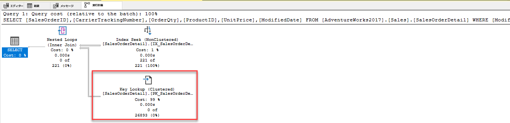


2. キー参照を修正し、クエリを再実行して、新しいプランを表示します。 キー検索を修正するには、クエリで返される、または検索されるすべての列を INCLUDE する COVERING インデックスを追加します。 この例では、インデックスには **ProductID** しかありませんでした。 含まれている列として出力リスト列をインデックスに追加し、他の検索列 (**ModifiedDate**) をキー列として追加すると、キー検索が削除されます。 インデックスはすでに存在しているため、インデックスをドロップして再作成するか、列を追加するために DROP_EXISTING=ON を設定する必要があります。 **ProductID** は既にインデックスの一部であり、含まれる列として追加する必要はないことに注意してください。

```sql
CREATE NONCLUSTERED INDEX IX_SalesOrderDetail_ProductID

ON [Sales].[SalesOrderDetail] (ProductID, ModifiedDate)

INCLUDE (CarrierTrackingNumber,OrderQty, UnitPrice)

WITH (DROP_EXISTING = ON);

GO
```

3. 手順 1 のクエリをもう一度実行します。 論理読み取りの変更と実行プランの変更をメモします。

# <a name="exercise-3-use-query-store-to-detect-and-handle-regression-in-adventureworks2017"></a>演習 3:クエリ ストアを使用して、AdventureWorks2017 の機能低下を検出して処理します。

予測される所要時間:15 分

このエクササイズのタスクは次のとおりです。

1. ワークロードを実行して QS のクエリ統計を生成します 

2. リソース消費量上位のクエリを調べて低いパフォーマンスを特定する 

3. より良い実行計画を強制します。 

## <a name="task-1-run-a-workload-to-generate-query-stats-for-query-store"></a>タスク 1:ワークロードを実行してクエリ ストアのクエリ統計を生成する

1. 以下のコードをコピーして新しいクエリ ウィンドウに貼り付け、[実行] をクリックして実行します。 実行プランと、[メッセージ] タブの論理読み取り数を記録しておきます。このスクリプトは、AdventureWorks2017 のクエリ ストアを有効にし、データベースの互換性レベルを 100 に設定します

```sql
USE master;
GO

ALTER DATABASE AdventureWorks2017 SET QUERY_STORE = ON;
GO

ALTER DATABASE AdventureWorks2017 SET QUERY_STORE (OPERATION_MODE = READ_WRITE);
GO

ALTER DATABASE AdventureWorks2017 SET COMPATIBILITY_LEVEL = 100;
GO
```


2. SQL Server Management Studio のメニューで、[ファイル] > [開く] > [ファイル] の順に選択します。 D:\Labfiles\Query Performance\CreateRandomWorkloadGenerator.sql ファイルに移動します。 ファイルをクリックして Management Studio にロードし、[実行] をクリックしてクエリを実行します。

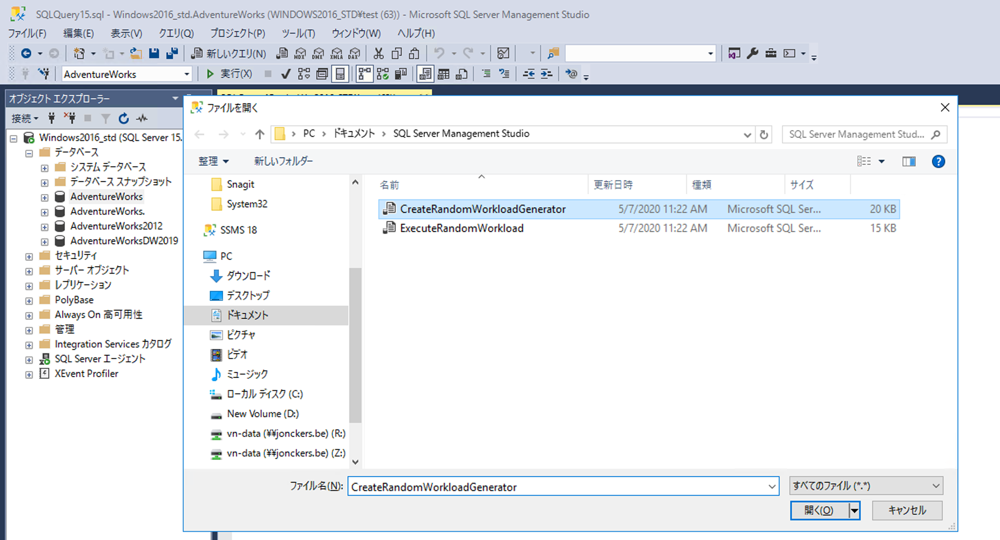

 
3. ワークロードを実行して、クエリ ストアの統計を生成します。 D:\Labfiles\Query Performance\ExecuteRandomWorkload.sql スクリプトに移動し、ワークロードを実行します。 スクリプトを実行するには、[実行] をクリックします。 実行が完了したら、スクリプトをもう一度実行して、さらにデータを生成します。 このクエリのクエリ タブは開いたままにします。

4. 以下のコードをコピーして新しいクエリ ウィンドウに貼り付け、[実行] をクリックして実行します。 このスクリプトを使用すると、データベース互換モードが SQL Server 2019 (150) に変更されます。

```sql
USE master;
GO

ALTER DATABASE AdventureWorks2017 SET COMPATIBILITY_LEVEL = 150;
GO
```

5. 手順 3 (ExecuteRandomWorkload.sql) のクエリ タブに戻り、もう一度実行します。

## <a name="task-2-examine-top-resource-consuming-queries-to-identify-poor-performance"></a>タスク 2:リソース消費量上位のクエリを調べて低いパフォーマンスを特定する

1. クエリ ストアを表示するには、Management Studio で AdventureWorks2017 データベースを更新する必要があります。 Management Studio がローカル SQL Server インスタンスに接続されていることを確認します。 データベース名を右クリックし、[更新] をクリックします。 データベースの下に [クエリ ストア] オプションが表示されます。  
‎   
   ‎

2. [クエリ ストア] ノードを展開して、使用可能なすべてのレポートを表示します。 プラス記号をクリックして、[クエリ ストア レポート] を展開します。 [最もリソースを消費するクエリ レポート] をダブルクリックして選択します。

    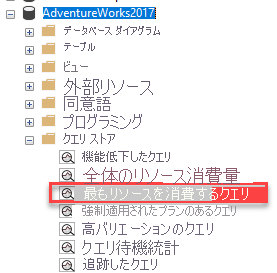

    次に示すようなレポートが開きます。  
    ‎ 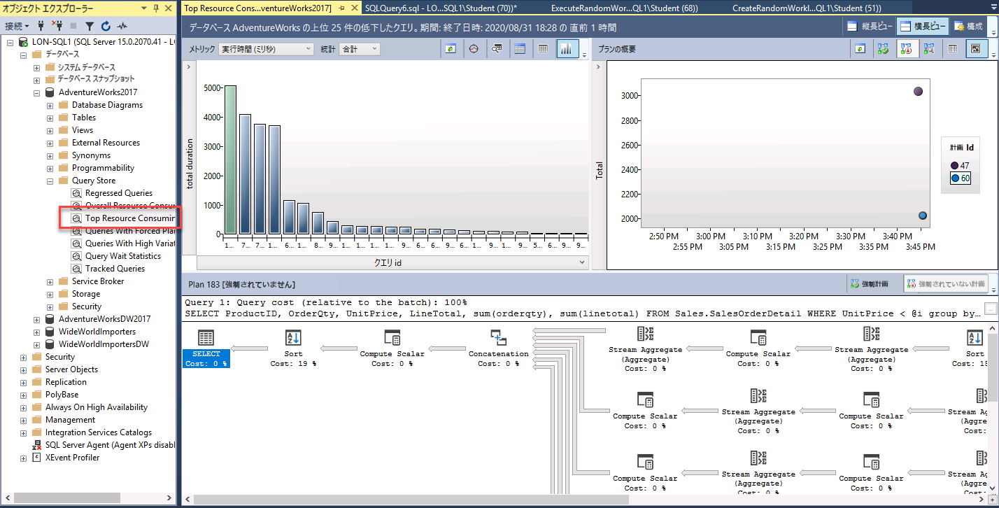
    
    SQL Server Management Studio のサイズが最大になっていることを確認します。 右上の [構成] をクリックします。 

    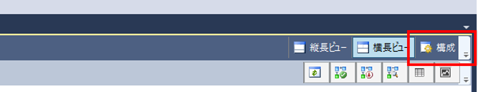

    構成画面で、クエリ プランの最小数のフィルターを 2 に変更します。 [適用] をクリックして、構成ウィンドウを閉じます。

    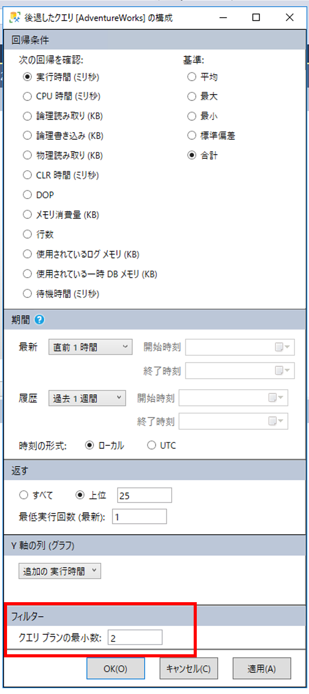

 

3. レポートの左上にある横棒グラフの左端のバーをクリックして、最も長い期間のクエリを選択します。

    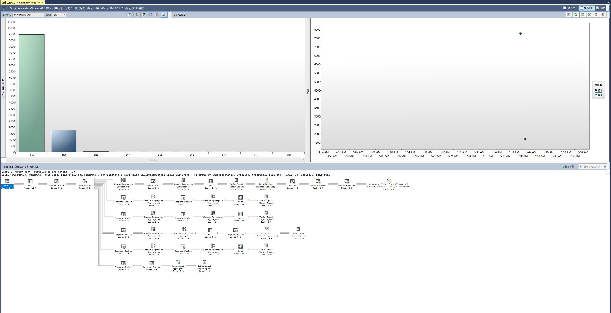  
‎


    これにより、クエリ ストア内の最長クエリのクエリとプランの概要が表示されます。 

    

## <a name="task-3-force-a-better-execution-plan"></a>タスク 3:より適切な実行プランを強制する

1. 次に示すように、レポートのプラン概要部分に移動します。 期間が大きく異なる 2 つの実行プランがあることに注意してください。

    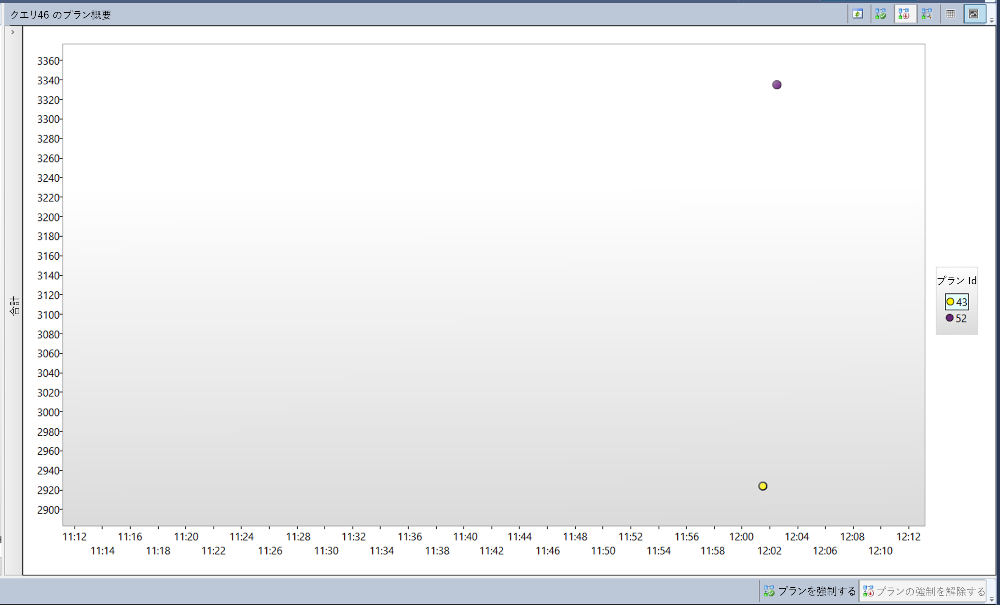  
‎

2. レポートの右上のウィンドウで、期間が最も短いプラン ID (グラフの Y 軸の低い位置で示されます) をクリックします。 上の図では PlanID 43 となっていますが、実際には別の PlanID が表示されている可能性があります。 プラン概要のグラフの横にあるプラン ID をクリックします (上記のスクリーンショットのように強調表示されているはずです)。

3. サマリーのグラフにある **[強制プラン]** をクリックします。 確認ウィンドウが表示されたら、[はい] を選択してプランを強制的に適用します。

    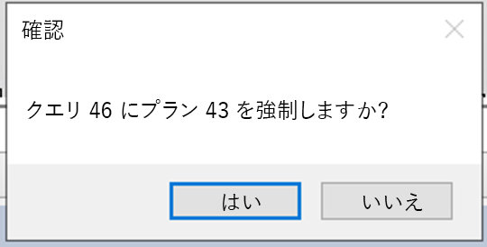   
‎

    強制すると、強制されたプランがグレーで表示されるようになり、プラン概要ウィンドウのプランに強制されたことを示すチェック マークが表示されます。

    
    
    
4. すべてのクエリ ウィンドウとクエリ ストア レポートを閉じます。
    

# <a name="exercise-4-use-query-hints-to-impact-performance-in-adventureworks2017"></a>演習 4:クエリ ヒントを使用して AdventureWorks2017 のパフォーマンスに影響を与える

予測される所要時間:15 分

この演習の主なタスクは、以下の通りです。

1. ワークロードを実行します。 

2. クエリを変更してパラメーターを使用します

3. クエリ ヒントをクエリに適用して値を最適化し、もう一度実行します。

## <a name="task-1-run-a-workload"></a>タスク 1:ワークロードを実行する

1. SQL Server Management Studio で新しいクエリ ウィンドウを開きます。 [実際の実行プランを含める] アイコンをクリックしてから、クエリを実行するか Ctrl+M キーを押します。
    
    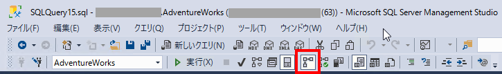  
‎
2. 次のクエリを実行します。 実行プランでインデックス シーク オペレーターが示されていることに注意してください。
        
    ```sql
    USE AdventureWorks2017

    GO

    SELECT SalesOrderId, OrderDate

    FROM Sales.SalesOrderHeader 

    WHERE SalesPersonID=288;
    ```
 
    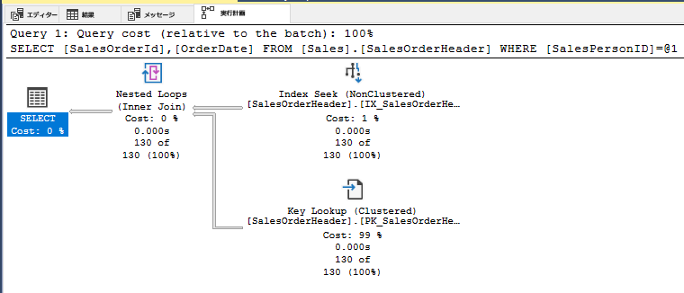

3. 今度は、次のクエリを実行します。 唯一の変更点は、検索される SalesPersonID 値が 277 であることです。 実行プランのクラスター化インデックス スキャン操作に注意してください。

    ```sql
    USE [AdventureWorks2017]

    GO

    SELECT SalesOrderId, OrderDate

    FROM Sales.SalesOrderHeader

    WHERE SalesPersonID=277;
    ```

    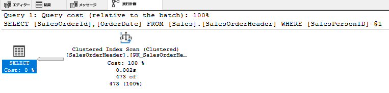

    WHERE 句で異なる句が使用されているため、クエリ オプティマイザーは列の統計に基づいて、別の実行プランを選択しました。 このクエリでは WHERE 句で定数を使用するため、オプティマイザはこれらの各クエリを一意と見なし、クエリごとに異なる実行プランを生成します。

## <a name="task-2-change-the-query-to-use-a-parameterized-stored-procedure-and-use-a-query-hint"></a>タスク 2:クエリを変更してパラメーター化されたストアド プロシージャを使用し、クエリ ヒントを使用します

1. [新しいクエリ] ウィンドウを開きます。 [実際の実行プランを含める] をクリックするか、Ctrl+M キーを押します。

2. WHERE 句でハードコードされた値の代わりに、検索する値をパラメーターとして渡すことができるように、パラメーター化されたストアド プロシージャを作成します。 パラメーターのデータ型がターゲット テーブルの列のデータ型と一致することを確認する必要があります。 次のコードをコピーして実行します。 

    ```sql
    USE AdventureWorks2017  
    GO 
    
    CREATE OR ALTER PROCEDURE getSalesOrder  
    @PersonID INT 
    AS 
    SELECT SalesOrderId, OrderDate 
    FROM Sales.SalesOrderHeader 
    WHERE SalesPersonID = @PersonID 
    GO
    
    ```

3. パラメーター値に 277 を指定してプロシージャを呼び出します。 次のコードをコピーして実行します。 

    ```sql
    EXEC getSalesOrder 277 
    GO  
    ```

    前に説明したように、パラメーター化されていない SELECT ステートメントを実行して値 277 を検索する場合、プランはクラスター化インデックス スキャンの使用を示します。 
    
4. パラメーター値に 288 を指定してプロシージャを再度実行します。 次のコードをコピーして実行します。 

    ```sql
    EXEC getSalesOrder 288 
    GO  
    ``` 

    実行プランを調べると、値が 277 の場合と同じであることがわかります。 これは、SQL Server が実行プランをキャッシュし、2 回目のプロシージャの実行に再利用しているためです。 両方のクエリに同じプランが使用されていますが、必ずしも最良のプランであるとは限りません。

5. 次のコマンドを実行して、AdventureWorks2017 データベースのプラン キャッシュをクリアします。

    ```sql
    USE AdventureWorks2017  
    GO 
    ALTER DATABASE SCOPED CONFIGURATION CLEAR PROCEDURE_CACHE;  
    GO
    ```

6. パラメーター値に 288 を指定してプロシージャを再度実行します。 次のコードをコピーして実行します。 

    ```sql
    EXEC getSalesOrder 288 
    GO  
    ``` 

    プランが非クラスター化インデックス シーク操作を使用していることに気付くはずです。  これは、キャッシュされたプランが削除され、新しい初期パラメーター値　288 に基づいて新しいプランが作成されたためです。 
 
7. 次に、クエリ ヒントを使用してストアド プロシージャを再作成します。 オプション ヒントにより、オプティマイザは値 288 に基づいてプランを作成し、プロシージャに渡されるパラメーター値に関係なくそのプランが使用されます。 

    プロシージャを複数回実行すると、非クラスター化インデックス シーク付きのプランが常に使用されるようになります。 まだ見ていないパラメーター値を指定してプロシージャを呼び出してみると、返される行の数 (または行が返されない) に関係なく、プランでは常に非クラスター化インデックス シークが使用されることに気づくでしょう。 

    ```sql
    USE AdventureWorks2017  
    GO 
    
    CREATE OR ALTER PROCEDURE getSalesOrder  
    @PersonID INT 
    AS 
    SELECT SalesOrderId, OrderDate  
    FROM Sales.SalesOrderHeader   
    WHERE SalesPersonID = @PersonID  
    OPTION (OPTIMIZE FOR (@PersonID = 288));  
    GO    
    
    EXEC getSalesOrder 288; 
    GO  
    
    EXEC getSalesOrder 277; 
    GO 
    
    EXEC getSalesOrder 200;
    GO 
    ``` 

8. すべてのクエリ ウィンドウを閉じます。 
