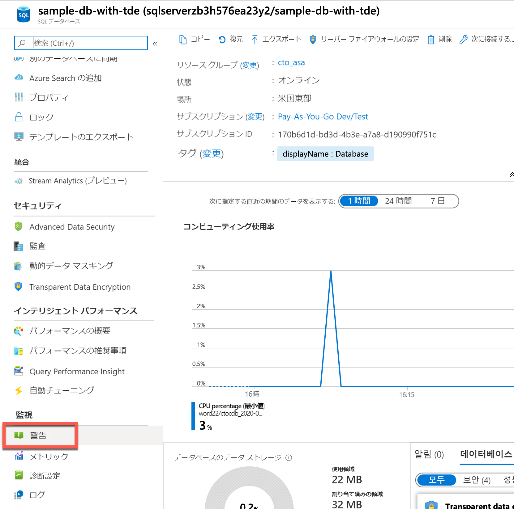
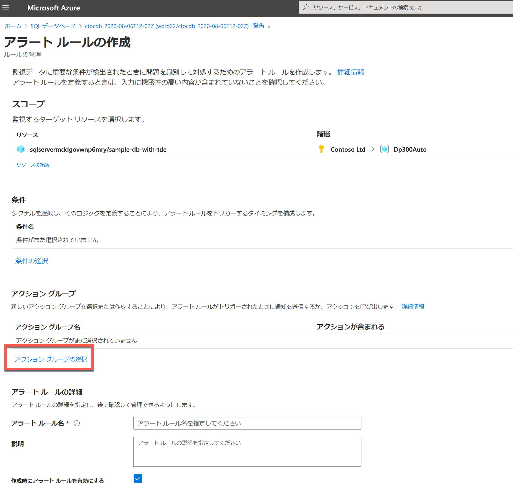
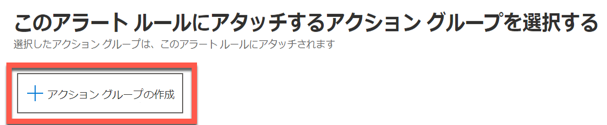
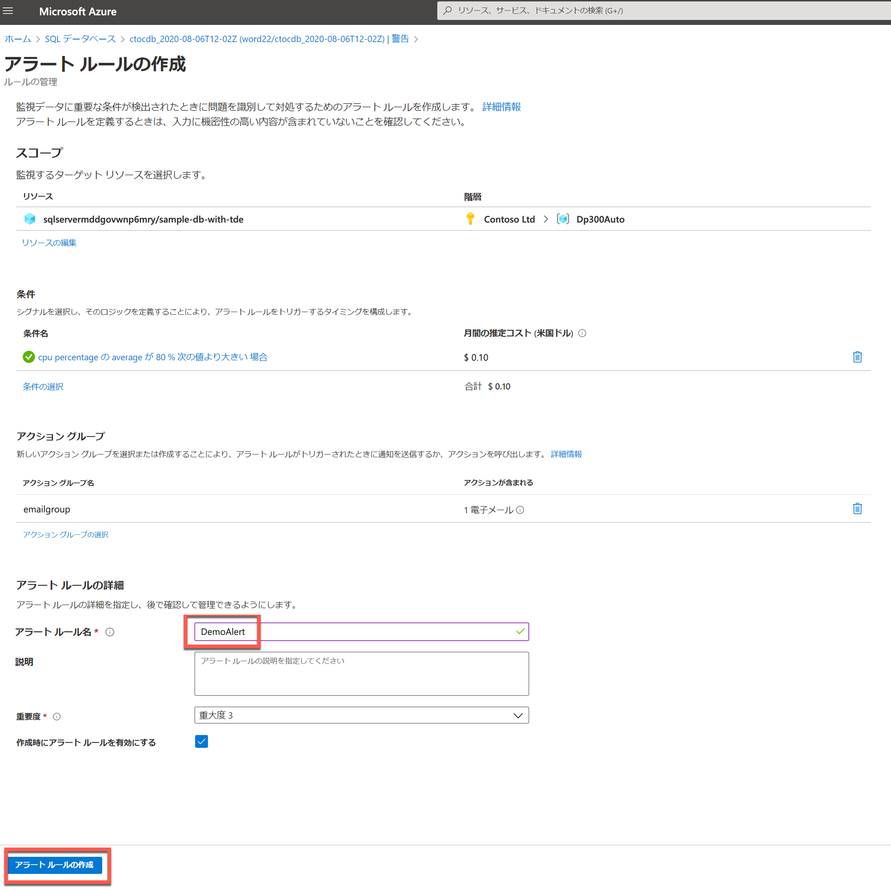
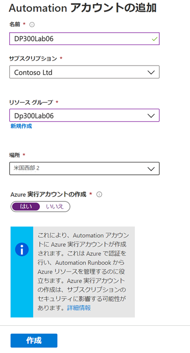

---
lab:
    title: 'ラボ 6 - リソースを自動化する'
    module: 'タスクの自動化'
---

# ラボ 6 - リソースを自動化する

 

**推定時間**: 90 分

このラボは、Azure portal にアクセスできる Web ブラウザーから実行できます。

注: このラボを完了するには、Microsoft.Insights モジュールをサブスクリプションに追加する必要があります。以下の手順を完了することで登録できます。 

Azure portal から、ポータルの右上にある 「cloud shell」 アイコンをクリックします。


画面の下部にシェルが開きます。以下に示すように 「PowerShell」 をクリックします。


ストレージ アカウントを作成するように促されることがあります。「ストレージの作成」 をクリックします。 


PowerShell ウィンドウが開いたら、以下のコマンドを貼り付けます: 

```sql
register-AzResourceProvider -ProviderNamespace Microsoft.Insights
``` 


 

**ラボ ファイル**: このラボのファイルは、D:\LabFiles\Automate リソース フォルダーにあります。

# ラボの概要

学生は、レッスンで得た情報を利用して、AdventureWorks 内で自動化プロセスを実装します。 

# ラボの目的

このラボを終了すると、次のことができるようになります。

- GitHub クイックスタート テンプレートから Azure リソースをデプロイする

- パフォーマンス メトリック関連の通知を構成する

- Azure Automation Runbook をデプロイして、Azure SQL データベースでインデックスのメンテナンスを実行する

# シナリオ

データベース管理の日常業務の自動化を支援するシニア データ エンジニアとして採用されました。この自動化は、AdventureWorks のデータベースがピーク パフォーマンスで動作し続けることを確実にするのに役立つだけでなく、特定の基準に基づいて警告する方法を提供することです。AdventureWorks は、サービスとしてのインフラストラクチャとサービスとしてのプラットフォームの両方で SQL Server を利用しています。 

 

# 演習 1: Azure クイックスタート テンプレートをデプロイする 

推定時間: 30 分

個別演習

この演習の主なタスクは、以下の通りです。

- GitHub クイックスタート テンプレートから Azure リソースをデプロイする

## タスク: テンプレートから Azure SQL Database をデプロイする

1. Web ブラウザーを使用して、次の GitHub に移動します。 

    [https://github.com/Azure/azure-quickstart-templates/tree/master/quickstarts/microsoft.sql/sql-database-transparent-encryption-create](https://github.com/Azure/azure-quickstart-templates/tree/master/quickstarts/microsoft.sql/sql-database-transparent-encryption-create)

 
    

    azuredeploy.json をクリックして、ファイルを確認します。 


2. 上のリンク (ブラウザーの左上にある矢印をクリックする) に戻り、「Azure にデプロイ」 ボタンをクリックします。Azure portal へのログインを求められる場合があります。提供された資格情報でログインします。


3. 次のような画面が表示されます。このテンプレートをデプロイするには、空白のフィールドを完成させる必要があります。

    「リソース グループ」 フィールドで、「新規作成」 をクリックし、「**DP300-Lab06**」を入力して 「OK」 をクリックします。リージョンをお近くのリージョンに変更します。残りのフィールドについては以下の値を使います:   
    
	- SQL 管理者のログイン: **labadmin**
	- SQL 管理者のログイン パスワード: **Azur3Pa$$** 
	- 透過的なデータ暗号化: **有効** 
	- 場所: **「resourceGroup().location」** 

     


4. 「確認および作成」 をクリックしてから、「作成」 をクリックします。デプロイが開始されます。ベル (下のスクリーンショットで強調表示されています) をクリックし、「通知」 ペインの 「デプロイ進行状況」 リンクをクリックすると、デプロイの状態を追跡できます。

    


    デプロイには約 5 ～ 10 分かかります。上記のリンクをクリックすると、デプロイを追跡できます。 

    

5. 完了すると、画面が更新され、新しく作成したリソースへのリンクが表示されます。 

    


    「リソースに移動」 リンクをクリックします。今作成したデプロイの Azure リソース グループに移動します。リソース グループに SQL サーバーと SQL Database の両方が表示されます。  次の演習で使用するため、SQL サーバーの名前をメモしておきます。

    

 

# 演習 2: パフォーマンス メトリック ベースのアラートを構成する

推定時間: 30 分

個別演習

この演習の主なタスクは、以下の通りです。

- パフォーマンス メトリック関連の通知を構成する

## タスク: CPU が平均 80％ を超えたときにアラートを作成します。

1. まだ入っていない場合、portal.azure.com に移動します。再度ログインする必要があるかもしれません。Azure Portal の上部にある検索バーに「SQL」と入力し、SQL データベースをクリックします。データベース名をクリックします: **sample-db-with-tde**

    


2. sample-db-with-tde データベースのメイン ブレードで、監視セクションに移動する 

3. 以下に示すように 「アラート」 をクリックします。

    


4.  以下の画面が表示されます。「+ 新しいアラート ルール」 をクリックします。

    

 

5. リソースには、作成した SQL サーバーがすでに入力されていることがわかります。「条件」 セクションで、「条件の追加」 をクリックします。

  


6. 「シグナル ロジックの構成」 フライ アウト メニューで、「CPU パーセンテージ」 を選択します。 

    


7. しきい値 80 を指定します。「Done」 をクリックします。

    

8. 「アクション グループ」 セクションで、「アクション グループの追加」 をクリックします

    
    

9. 「アクション グループ」 のフライ アウトで、「+ アクション グループの作成」 をクリックします。


    

    「アクション グループの作成」 画面で、次のように入力します。 
    - アクション グループ名: **emailgroup** 
    - 表示名: **emailgroup**

    

    「**次へ: 通知 >**」 をクリックします:   
10. 次に、ドロップダウン**通知タイプ**をクリックし、**「電子メール/SMS メッセージ/プッシュ/音声」** を選択して、DemoLab という名前を入力します。

    


11. 右側のフライアウト画面で (上の画像を参照)、電子メールの横にあるチェックボックスをクリックし、電子メール アドレスを入力して 「OK」 をクリックします。次に、「確認および作成」 ボタンをクリックし、「アクション グループの作成」 画面で 「作成」 をクリックします。


    「アラート ルールの作成」 画面で、DemoAlert という名前のアラート ルールを追加し、次に示すように 「アラート ルールの作成」 をクリックします。
 

    

 


# 演習 3: Automation Runbook をデプロイする


推定時間: 30 分

個別演習

この演習の主なタスクは次のとおりです。

- メンテナンス タスク スクリプトをデプロイします。

- Azure Automation Runbook をデプロイして、Azure SQL データベースでインデックスのメンテナンスを実行する

## タスク: Azure SQL Database でインデックスを再構築する Automation Runbook をデプロイします。

1. まだ Azure ポータルに入っていない場合は、ラボの仮想マシンからブラウザー セッションを開始し、[https://portal.azure.com](https://portal.azure.com/) に移動します。適切な資格情報を提供します。 

    

2. Azure portal の検索バーに「Automation」と入力し、「Automation Accounts」 をクリックします

    

    ポータルの 「**+ 作成**」 ボタンをクリックします。
 
    

3. Automation アカウントを作成する

    


    名前: **DP300Lab06**

    リソース グループ: このラボで以前に作成したリソース グループを使用します。**DP300-Lab06**

    場所: ラボ 2 で Azure SQL サーバーを作成したリージョンを使用する

    **作成**をクリックします。Automation アカウントは 1 〜 3 分でデプロイされます。 


4. AdaptativeIndexDefragmentation の **github** のページに移動します。[https://github.com/microsoft/tigertoolbox/blob/master/AdaptiveIndexDefrag/usp_AdaptiveIndexDefrag.sql](https://github.com/microsoft/tigertoolbox/blob/master/AdaptiveIndexDefrag/usp_AdaptiveIndexDefrag.sql)

    

 
    「行」 をクリックします。これにより、コードがコピーできる形式で提供されます。すべてのテキストを選択 (Ctrl-A) し、クリップボードにコピーします (Crtl-C)。 


5. Azure portal でデータベースに戻り、以下に示すようにクエリ エディターをクリックします。

    

6. データベースにログインするための資格情報の入力を求められます。演習 1 で作成した資格情報を使用します。   
   **ログイン**: labadmin    
   **パスワード**: Azur3Pa$$

    ログインしようとすると、ホワイトリスト IP に関するエラーが表示される場合があります。エラーメッセージの最後にある青い 「**ホワイトリスト IP**」 リンクをクリックします。これを行うと、サーバー ファイアウォール規則が更新され、アクセスが許可されます。

    

7. 成功メッセージが表示されたら、ログイン画面でもう一度 「**OK**」 をクリックします。今回は、SQL データベース クエリ エディターへのアクセスを許可する必要があります。 

8. クエリ エディターで、このタスクの前半でコピーしたテキストを GitHub から 「クエリ 1」 ペインに貼り付けます。スクリプトの 5 行目と 6 行目の **USE msdb** ステートメントと **GO** ステートメントを削除します。

    

9. **実行**をクリックします。クエリの結果は次のメッセージになります。 

    

10. Azure portal で、検索フィールドに「自動化」と入力します。  **「Automation アカウント」** をクリックします。 

    

    サブスクリプションで作成された Automation アカウントを識別し、それをクリックします。

    

12. Automation ブレードの 「共有リソース」 セクションで、「**モジュール**」 を選択します。 

    

13. 「**ギャラリーを参照**」 をクリックします

    


14. ギャラリー内で sqlserver を検索する

    


15. 次の画面に移動する SqlServer テキストをクリックします。「**インポート**」 をクリックします。
    

16.  モジュールをインポートするには、画面下部の隅にある 「**OK**」 をクリックします。これにより、PowerShell モジュールが Automation アカウントにインポートされます。
    


17. データベースに安全にログインするには、資格情報を作成する必要があります。「Automation アカウント」 ブレードから 「共有リソース」 セクションに移動し、「**資格情報**」 をクリックします。

    


18. 「**+ 資格情報の追加**」 をクリックし、次に示すように資格情報を作成します。
    - 名前: **SQLUser** 
    - ユーザー名: **labadmin** 
    - パスワード: **Azur3Pa$$** 
    
    「**作成**」 をクリックします。

    


19. 「Automation アカウント」 ブレードの 「プロセス オートメーション」 セクションまでスクロールし、「**Runbooks**」 をクリックして、「**+ Runbook の作成**」 をクリックします。

    

20. 「Runbook の作成」 パネルで、次のように入力します。 
    - 名前: **IndexMaintenance** 
    - Runbook の種類: **Powershell** 
    - 説明: 選択内容の短い説明を提供できます。 
    「**作成**」 をクリックします。 

    

    Runbook が作成されると、プロセスによって Runbook に直接移動されます。   
‎

21. Windows Explorer を使用して、フォルダ D:\LabFIles\Automate Resources に移動します。DP300-Lab-Module-6.ps1 ファイルを右クリックして、「編集」 をクリックします。PowerShell IDE が開きます。

    
    
22. Azure SQL サーバーの名前を反映するために $AzureSQLServerName 変数を編集してます。以下のように、Azure SQL データベースの概要画面からこの値を取得できます。

    

23. .database.windows.net ドメイン サフィックスを含むサーバーの名前をコピーします。 

    


24. ファイルの 1 行目にサーバー名を貼り付けます。すべてのテキストを選択し、クリップボードにコピーします。 


25. Automation Runbbok に戻り、PowerShell IDE からコピーした PowerShell コードを貼り付けます。次に 「保存」 をクリックし、「**発行**」 をクリックします。

    

26. 以前に発行されたバージョンを上書きするように求められたら、「はい」 をクリックします。 

    

27. 次に、Runbook をスケジュールして定期的に実行されるようにします。左側のナビゲーション メニューで 「**スケジュール**」 をクリックします。次に、上部にある 「**+ スケジュールの追加**」 をクリックします。 

    

28. 「**スケジュールを Runbook にリンクする**」 をクリックします。 
    
    

29. 「**+ スケジュールの追加**」 を選択します。 

    

30. 必要に応じて、わかりやすいスケジュール名と説明を入力します。 

31. 翌日の午前 4 時の開始時刻を東部標準時で指定します。1 日ごとの繰り返しを構成します。有効期限は設定しないでください。 

    

32.  「**作成**」 をクリックします。**「OK」** をクリックします。 

33. これで、スケジュールが Runbook にリンクされました。 

    

 

 

 

 

 
