---
lab:
  title: ラボ 6 - リソースを自動化する
  module: Automation of Tasks
---

# <a name="lab-6--automate-resources"></a>ラボ 6 - リソースを自動化する

**推定時間**:90 分

このラボは、Azure portal にアクセスできる Web ブラウザーから実行できます。

Note: the Microsoft.Insights module needs to be added to your subscription in order to complete this lab. You can register by completing the following steps.

Azure portal から、ポータルの右上にある [cloud shell] アイコンをクリックします。


A shell will open at the bottom of the screen. Click on PowerShell as shown below.

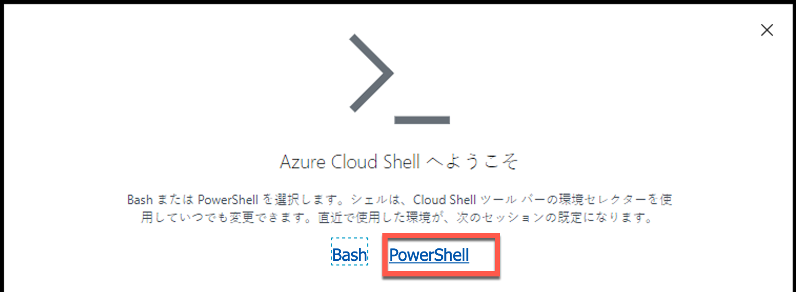

You may be prompted to create a storage account. Click Create Storage.

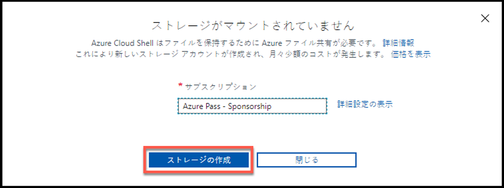

PowerShell ウィンドウが開いたら、以下のコマンドを貼り付け、Enter キーを押します。

```sql
register-AzResourceProvider -ProviderNamespace Microsoft.Insights
```


**ラボ ファイル**：このラボのファイルは、D:\LabFiles\Automate リソース フォルダーにあります。

# <a name="lab-overview"></a>ラボの概要

学生は、レッスンで得た情報を利用して、AdventureWorks 内で自動化プロセスを実装します。

# <a name="lab-objectives"></a>ラボの目的

このラボを完了すると、次のことができるようになります。

- GitHub クイックスタート テンプレートから Azure リソースをデプロイする

- パフォーマンス メトリック関連の通知を構成する

- Azure Automation Runbook をデプロイして、Azure SQL データベースでインデックスのメンテナンスを実行する

# <a name="scenario"></a>シナリオ

You have been hired as a Senior Data Engineer to help automate day to day operations of database administration. This automation is to help ensure that the databases for AdventureWorks continue to operate at peak performance as well as provide methods for alerting based on certain criteria. AdventureWorks utilizes SQL Server in both Infrastructure as a Service and Platform as a Service offerings.

# <a name="exercise-1-deploy-an-azure-quickstart-template"></a>演習 1:Azure クイックスタート テンプレートをデプロイする 

予測される所要時間:30 分

個別演習

この演習の主なタスクは、以下の通りです。

- GitHub クイックスタート テンプレートから Azure リソースをデプロイする

## <a name="task-deploy-an-azure-sql-database-from-a-template"></a>タスク:テンプレートから Azure SQL Database をデプロイする

1. Web ブラウザーを使用して、次の GitHub に移動します。

    [https://github.com/Azure/azure-quickstart-templates/tree/master/quickstarts/microsoft.sql/sql-database-transparent-encryption-create](https://github.com/Azure/azure-quickstart-templates/tree/master/quickstarts/microsoft.sql/sql-database-transparent-encryption-create)

    

    azuredeploy.json をクリックして、ファイルを確認します。

2. Navigate back to the above link (click the back arrow in the top left of the browser), and click on the Deploy to Azure button. You may be prompted to login to the Azure portal. Login with your supplied credentials.

3. 注: このラボを完了するには、Microsoft.Insights モジュールをサブスクリプションに追加する必要があります。

    以下の手順を完了することで登録できます。

    - SQL 管理者ログイン: **labadmin**
    - SQL 管理者のログイン パスワード:**Azur3Pa$$**
    - Transparent Data Encryption:**有効**
    - 場所: **[resourceGroup().location]**

    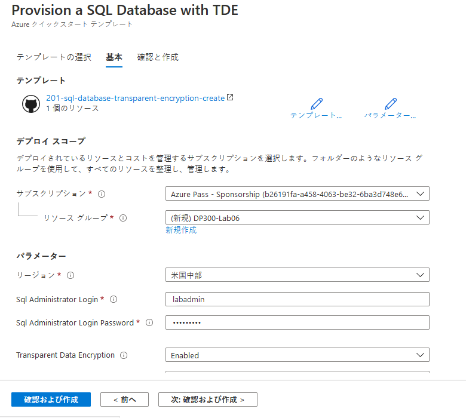

4. Click Review + create, then click Create. Your deployment will begin. You can track the status of your deployment by clicking the bell (highlighted in the screenshot below) and then clicking on the Deployment in progress link in the Notifications pane.

    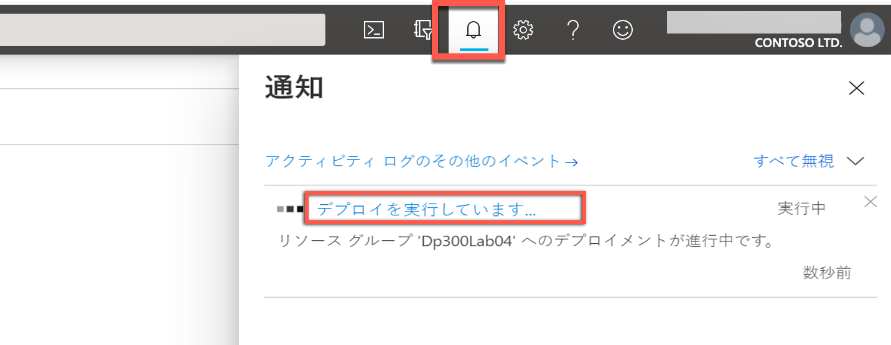

    Your deployment will take approximately 5-10 minutes to deploy. If you have clicked on the link above, you will be able to track your deployment.

    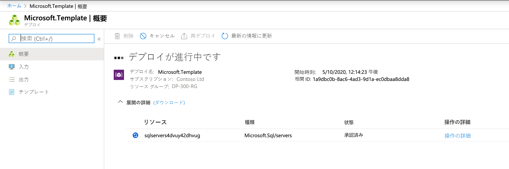

5. 完了すると、画面が更新され、新しく作成したリソースへのリンクが表示されます。

    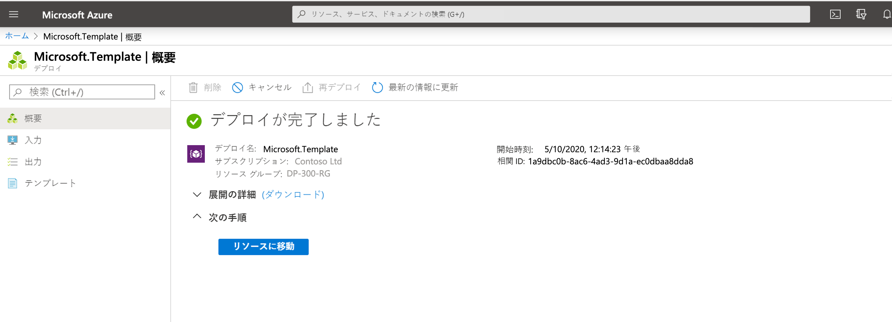

    Click on the Go to resource link. You will be taken to the Azure Resource Group your deployment just created. You should see both a SQL server and a SQL database in the Resource group.  Make note of the name of your SQL server, as you will it in the next exercise.

    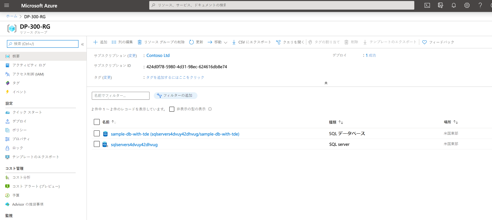

# <a name="exercise-2-configure-performance-metrics-based-alerts"></a>演習 2:パフォーマンス メトリック ベースのアラートを構成する

予測される所要時間:30 分

個別演習

この演習の主なタスクは、以下の通りです。

- パフォーマンス メトリック関連の通知を構成する

## <a name="task-creating-an-alert-when-cpu-exceeds-an-average-of-80-percent"></a>タスク:CPU が平均 80％ を超えたときにアラートを作成します。

1. 画面の下部にシェルが開きます。

    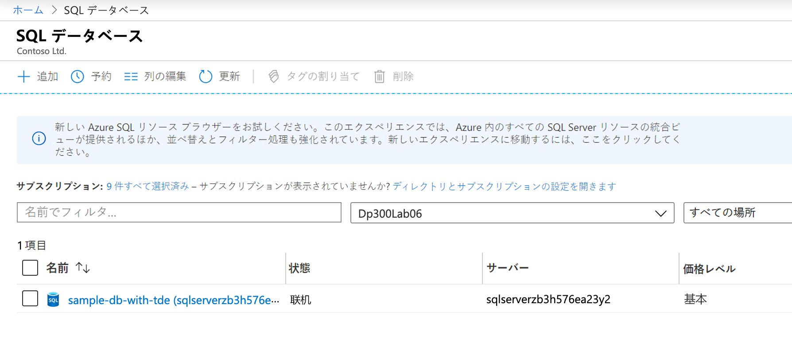

2. sample-db-with-tde データベースのメイン ブレードで、[監視] セクションまで下に移動します。

3. 以下に示すように [PowerShell] をクリックします。 

    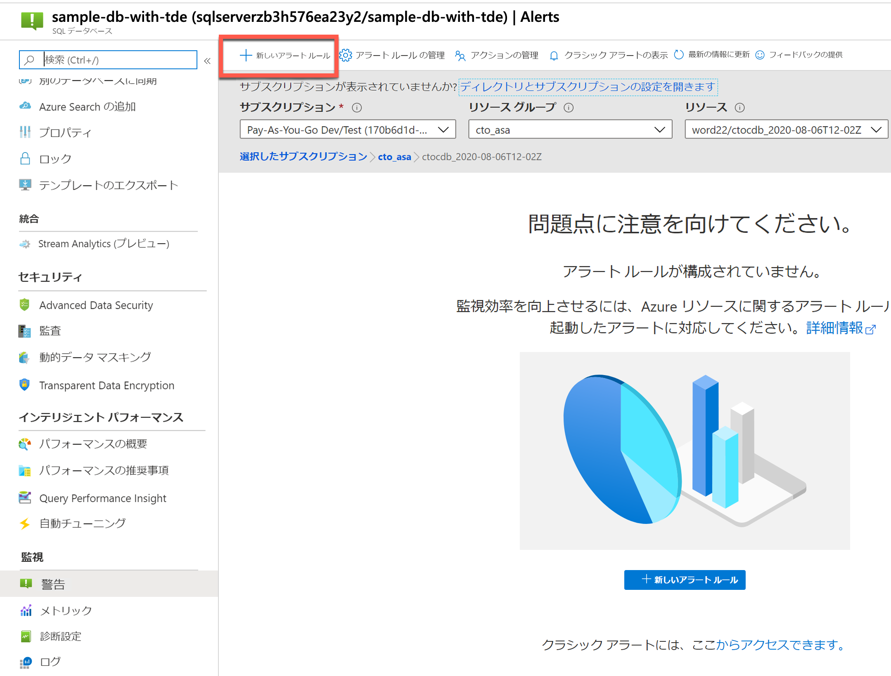

4. You will notice that the resource is already populated for you with the SQL Server you created. If the <bpt id="p1">**</bpt>Select a signal<ept id="p1">**</ept> window is already open then proceed to the next step. Under the Condition section, click Add condition. 

  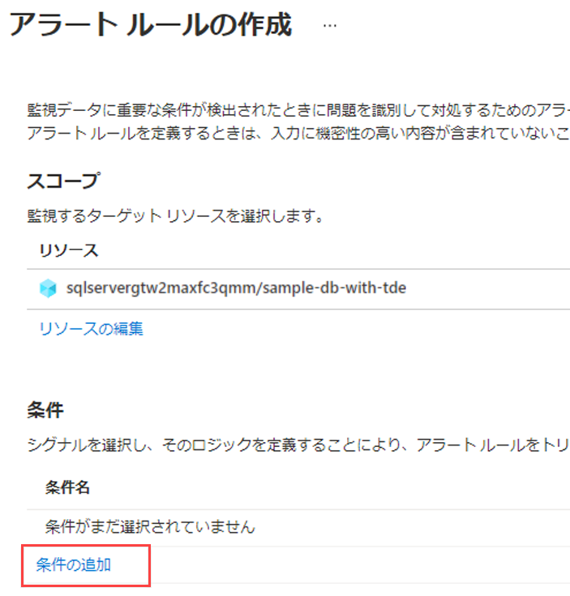

5. [シグナル ロジックの構成] フライ アウト メニューで、[CPU パーセンテージ] を選択します。

    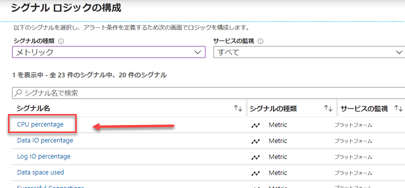

6. Supply a threshold value of 80. Click Done.

    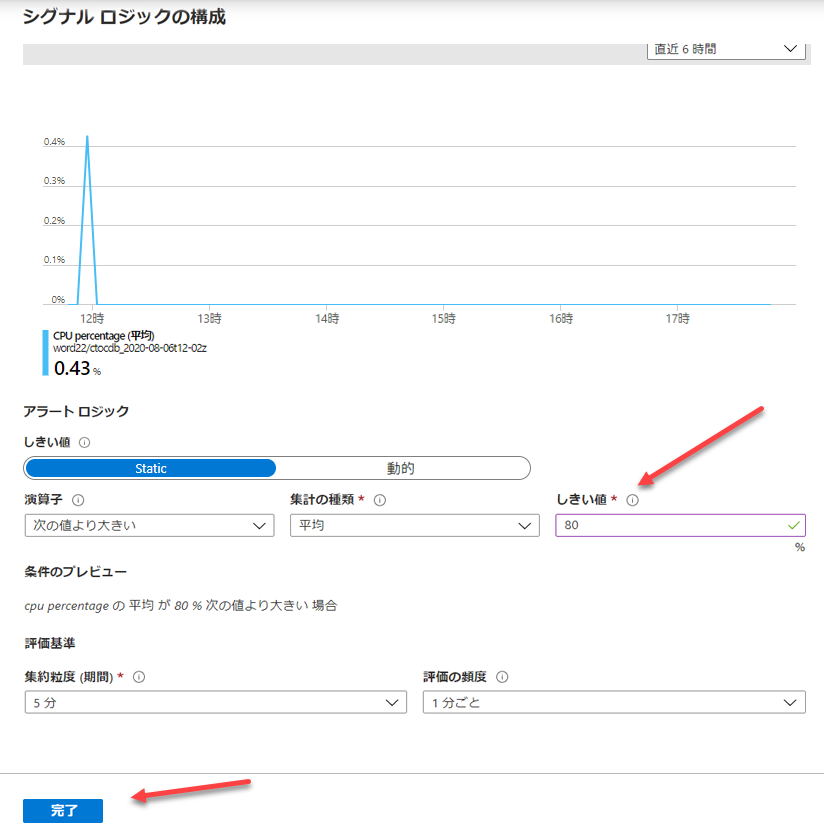

7. **[アクション]** タブの [アクション グループ] セクションで、 **[アクション グループの作成]** を選びます。

8. [アクション グループの作成] 画面で、次のように入力します。
    - アクション グループ名: **emailgroup**
    - 表示名: **emailgroup**

    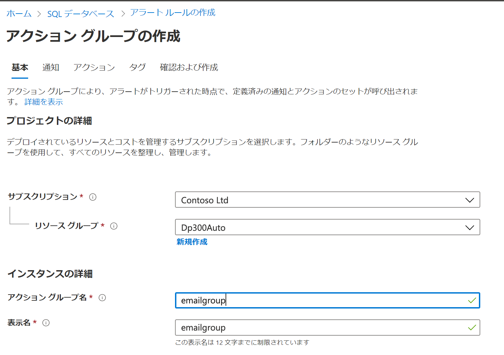

    **[次へ: 通知 >]** を選びます。

9. 次に、ドロップダウン**通知タイプ**をクリックし、 **[電子メール/SMS メッセージ/プッシュ/音声]** を選択して、DemoLab という名前を入力します。

    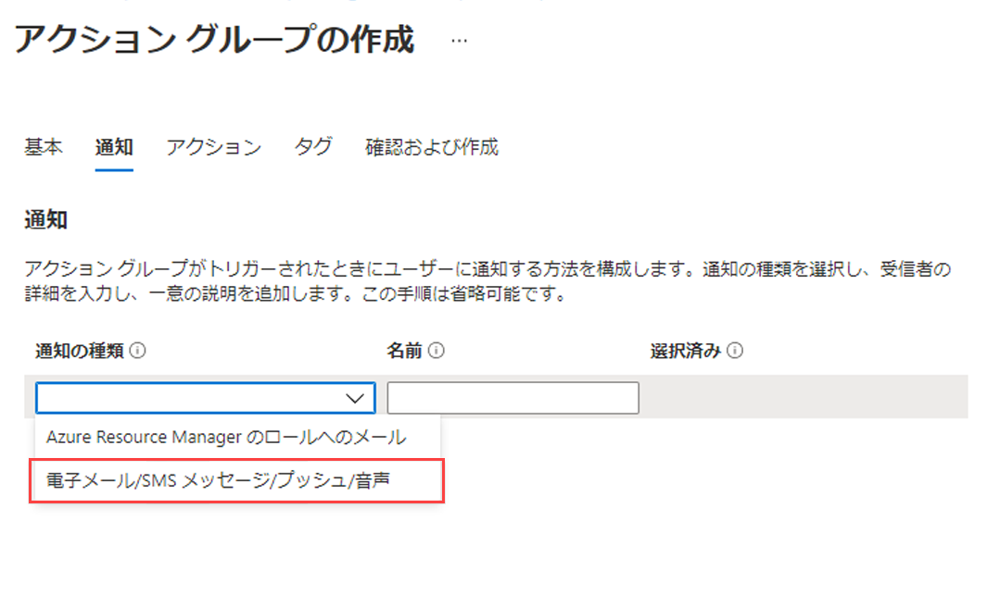

10. ストレージ アカウントを作成するように促されることがあります。

    [アラート ルールの作成] 画面の **[詳細]** メニューで、DemoAlert という名前のアラート ルールを追加し、 **[確認および作成]** 、 **[作成]** の順に選びます。

# <a name="exercise-3-deploy-an-automation-runbook"></a>演習 3:Automation Runbook をデプロイする

予測される所要時間:30 分

個別演習

この演習の主なタスクは次のとおりです。

- メンテナンス タスク スクリプトをデプロイします。

- Azure Automation Runbook をデプロイして、Azure SQL データベースでインデックスのメンテナンスを実行する

## <a name="task-deploy-an-automation-runbook-to-rebuild-indexes-in-an-azure-sql-database"></a>タスク:Azure SQL Database でインデックスを再構築する Automation Runbook をデプロイします。

1. [ストレージの作成] をクリックします。 

    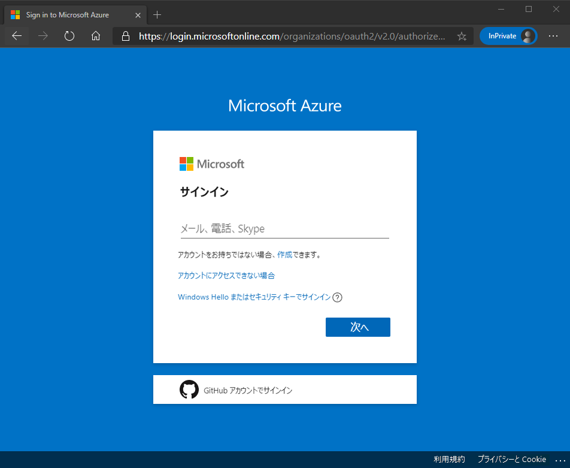

2. Azure portal の検索バーに「Automation」と入力し、[Automation Accounts] をクリックします

    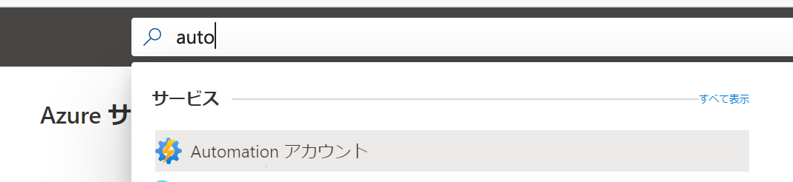

    ポータルの **[+ 作成]** ボタンをクリックします。

    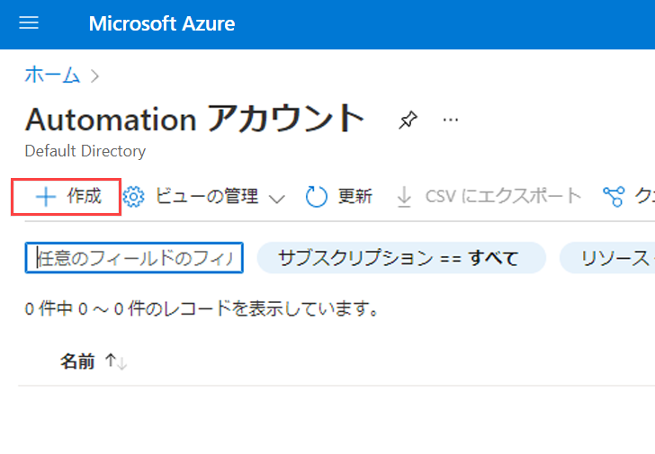

3. Automation アカウントを作成する

    Resource Group: Use the resource group you created earlier in this lab. <bpt id="p1">**</bpt>DP300-Lab06<ept id="p1">**</ept>

    名前: **DP300Lab06**

    場所: ラボ 2 で Azure SQL サーバーを作成したリージョンを使用する

    Select <bpt id="p1">**</bpt>Review + create<ept id="p1">**</ept> and <bpt id="p2">**</bpt>Create<ept id="p2">**</ept>. Your automation account should deploy in 1-3 minutes.


4. AdaptativeIndexDefragmentation の **github** ページに移動します。 [https://github.com/microsoft/tigertoolbox/blob/master/AdaptiveIndexDefrag/usp_AdaptiveIndexDefrag.sql](https://github.com/microsoft/tigertoolbox/blob/master/AdaptiveIndexDefrag/usp_AdaptiveIndexDefrag.sql)

    

    Click on Raw. This will provide the code in a format where you can copy it. Select all of the text (Ctrl-A) and copy it to your clipboard (Crtl-C).

5. Azure portal でデータベースに戻り、以下に示すようにクエリ エディターをクリックします。

    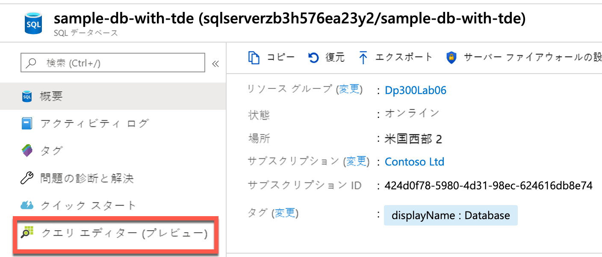

6. You will be prompted for credentials to login to your database. Use the credentials you created in Exercise 1.
   <bpt id="p1">**</bpt>Login<ept id="p1">**</ept>: labadmin <bpt id="p2">**</bpt>Password<ept id="p2">**</ept>: Azur3Pa$$

    When you try to log in, you may receive an error about a Whitelist IP. Click on the blue <bpt id="p1">**</bpt>Whitelist IP<ept id="p1">**</ept> link at the end of the error message. Doing so will update server firewall rules to allow access.

    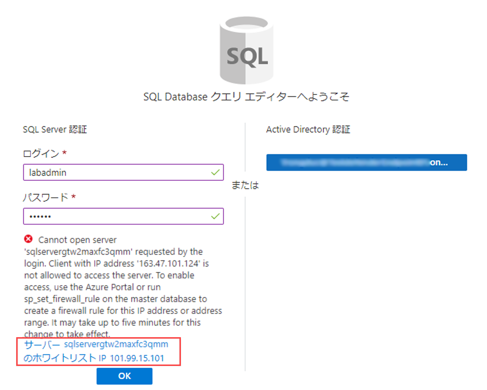

7. After you see a success message, click <bpt id="p1">**</bpt>OK<ept id="p1">**</ept> on the log in screen again. This time you should be granted access to SQL Database Query Editor.

8. In the query editor, paste the text you copied earlier in this task from GitHub into the Query 1 pane. Delete the <bpt id="p1">**</bpt>USE msdb<ept id="p1">**</ept> and <bpt id="p2">**</bpt>GO<ept id="p2">**</ept> statements on lines 5 and 6 of the script.

    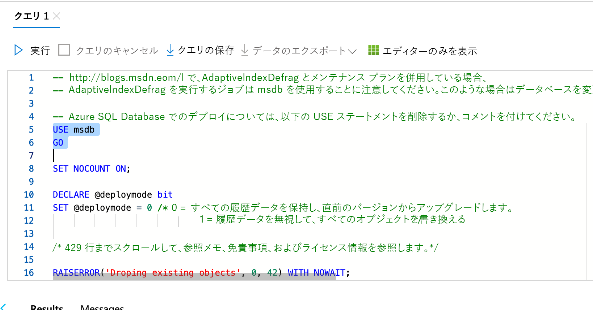

9. Click <bpt id="p1">**</bpt>Run<ept id="p1">**</ept>. The query should result in the following message:

    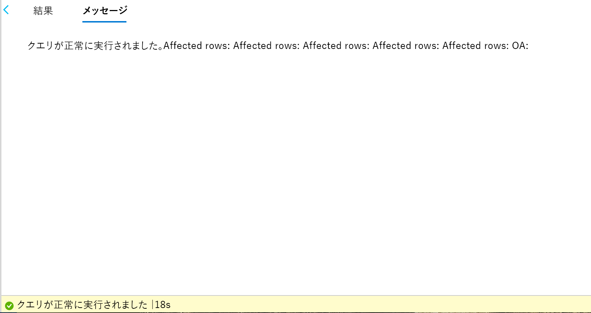

10. In the Azure portal, type automation within the search field. Click on <bpt id="p1">**</bpt>Automation Accounts<ept id="p1">**</ept>.

    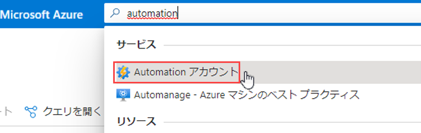

    サブスクリプションで作成された Automation アカウントを識別し、それをクリックします。

    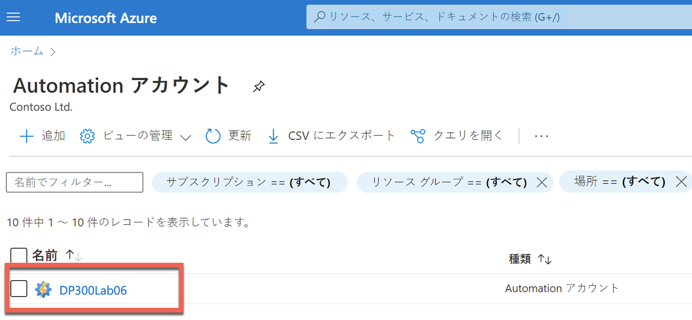

12. Automation ブレードの [共有リソース] セクションで、**[モジュール]** を選択します。

    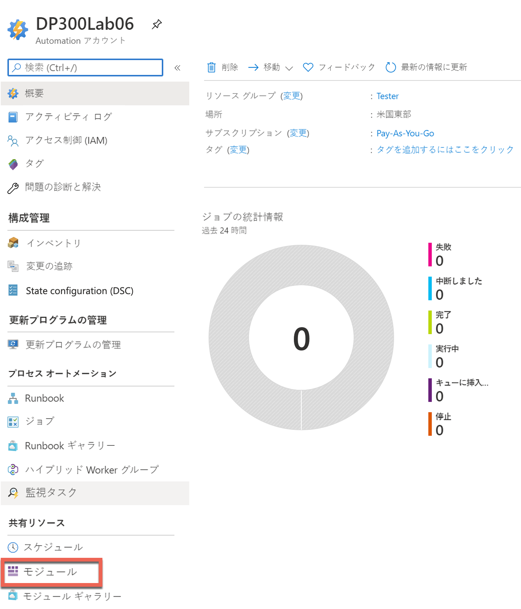

13. **[ギャラリーを参照]** をクリックします

    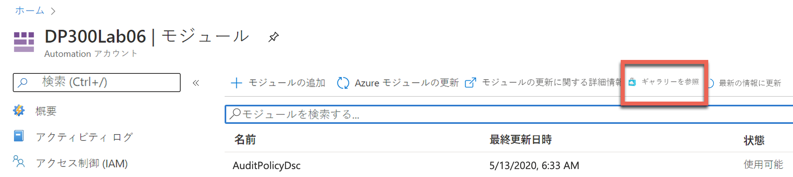

14. ギャラリー内で sqlserver を検索する

    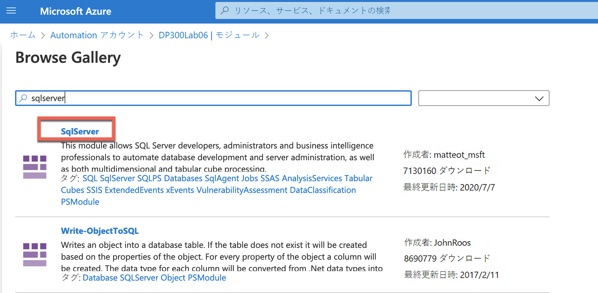

15. Click on the SqlServer text which will direct to the next screen. Click on <bpt id="p1">**</bpt>Select<ept id="p1">**</ept>.
    <ph id="ph1">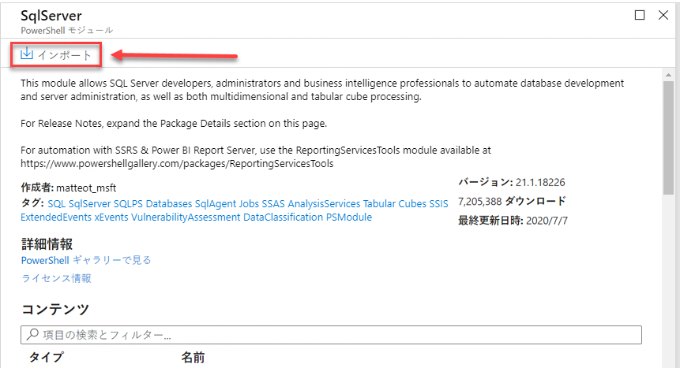</ph>

16. On the <bpt id="p1">**</bpt>Add a module<ept id="p1">**</ept> page, select the latest <bpt id="p2">**</bpt>Runtime version<ept id="p2">**</ept> available, and then click <bpt id="p3">**</bpt>Import<ept id="p3">**</ept>. This will import the PowerShell module into your Automation account.

    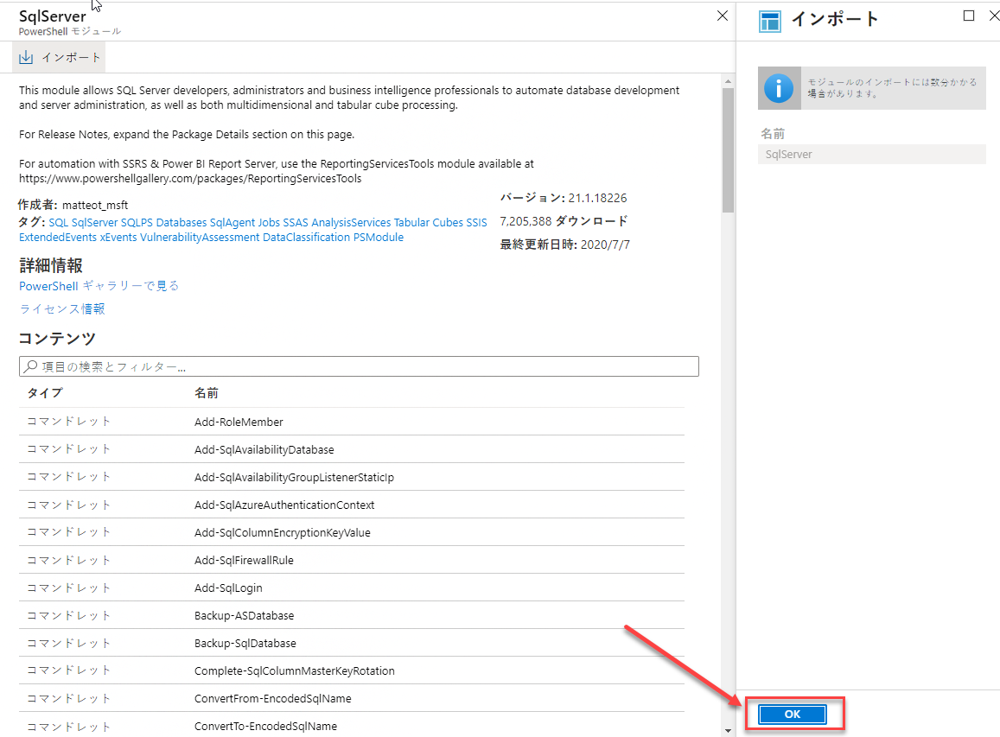

17. You will need to create a credential to securely login to your database. From the Automation Account blade navigate to the Shared Resources Section and click <bpt id="p1">**</bpt>Credentials<ept id="p1">**</ept>.

    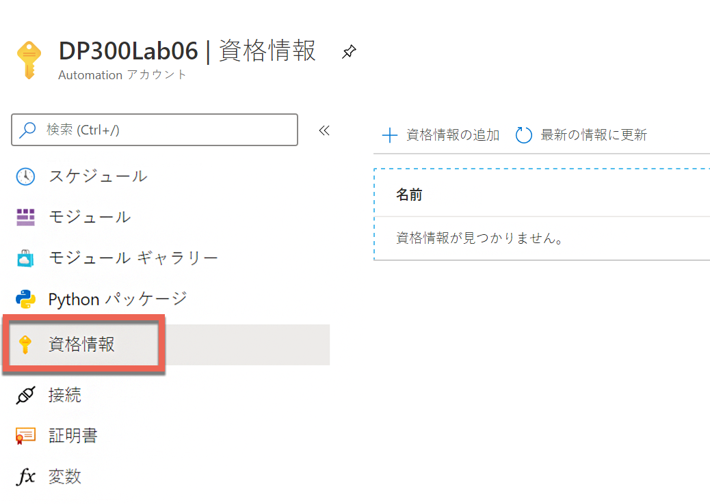

18. **[+ 資格情報の追加]** をクリックし、次に示すように資格情報を作成します。
    - 名前: **SQLUser**
    - ユーザー名: **labadmin**
    - パスワード: **Azur3Pa$$**

    **[作成]** をクリックします。

    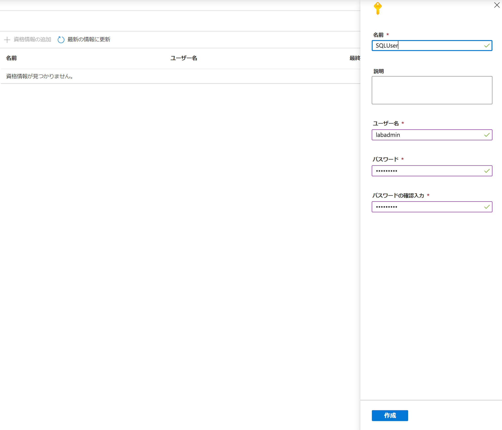

19. Automation アカウント ブレードの プロセス オートメーション セクションまでスクロールし、**Runbooks** をクリックして、 **+ Runbook の作成** をクリックします。

    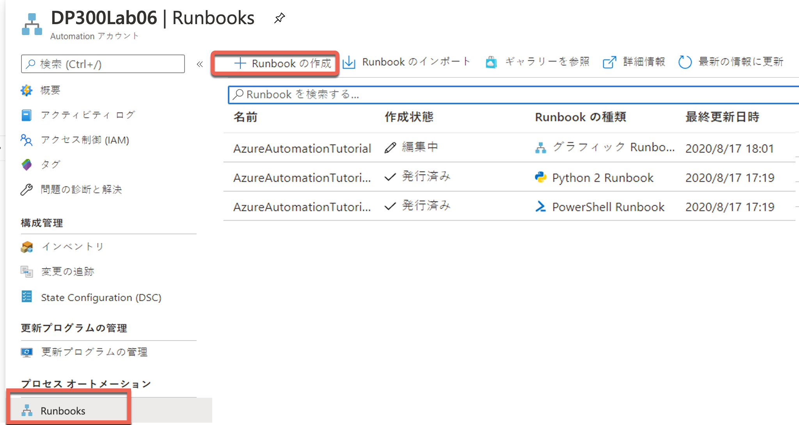

20. [Runbook の作成] パネルで、次のように入力します。
    - 名前: **IndexMaintenance**
    - Runbook の種類:**Powershell**
    - ランタイム バージョン:使用できる最新のランタイム バージョンを選びます
    - Description: You can supply a short description of your choosing.
    Click <bpt id="p1">**</bpt>Create<ept id="p1">**</ept>.

    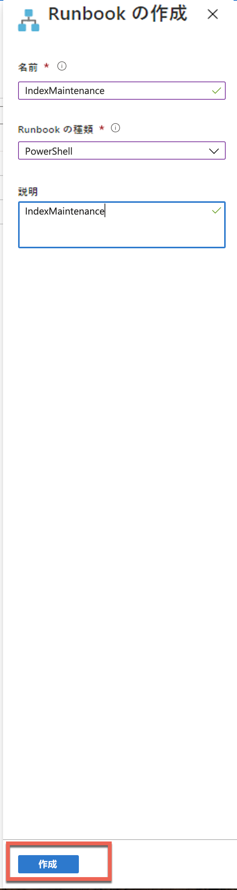

    Runbook が作成されると、プロセスによって Runbook に直接移動されます。

21. あなたはデータベース管理の日常業務を自動化するために、シニア データ エンジニアとして採用されました。

    

22. この自動化はピーク時のパフォーマンスで AdventureWorks のデータベースの稼働を確実に続けるうえで役に立つだけでなく、特定の条件に基づいてアラートを生成することもできるようにします。

    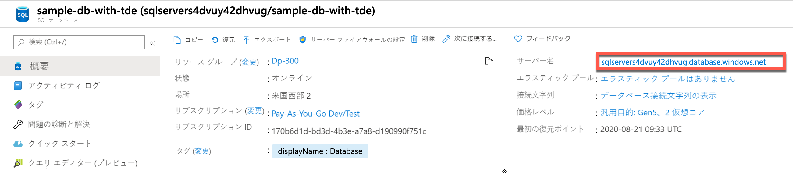

23. .database.windows.net ドメイン サフィックスを含むサーバーの名前をコピーします。

    

24. AdventureWorks では、サービスとしてのインフラストラクチャと、サービスとしてのプラットフォームの両方のオファリングで SQL Server が利用されています。

25. Navigate back to your automation runbook, and paste in the PowerShell code you copied from the PowerShell IDE. Then click Save and then click <bpt id="p1">**</bpt>Publish<ept id="p1">**</ept>.

    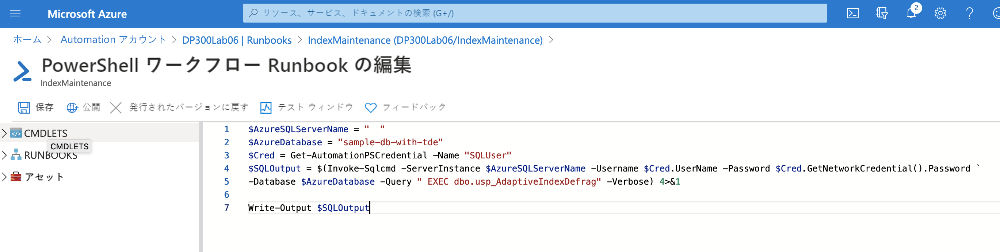

26. 以前に発行されたバージョンを上書きするように求められたら、[はい] をクリックします。

    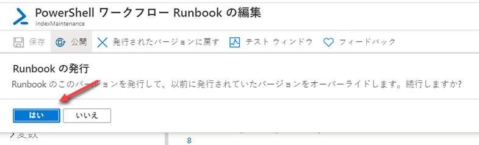

27. Next you will schedule the runbook to execute on a regular basis. Click on <bpt id="p1">**</bpt>Schedules<ept id="p1">**</ept> in the left hand navigation menu. Then click on <bpt id="p1">**</bpt>+ Add a schedule<ept id="p1">**</ept> at the top.

    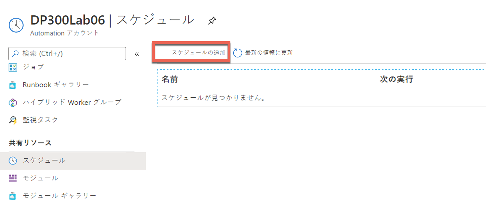

28. **[スケジュールを Runbook にリンクする]** をクリックします。

    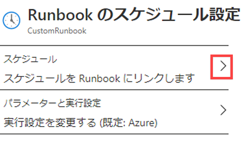

29. **[+ スケジュールの追加]** を選択します。

    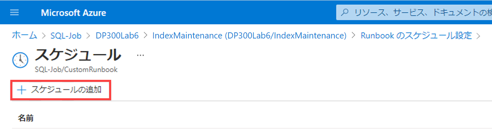

30. 必要に応じて、わかりやすいスケジュール名と説明を入力します。

31. Specify the start time of 4:00AM of the following day and in the Eastern Time zone. Configure the reoccurrence for every 1 Day. Do not set an expiration.

    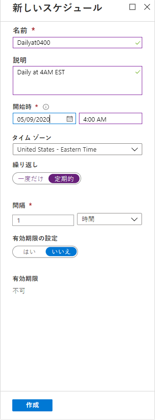

32.  Click <bpt id="p1">**</bpt>Create<ept id="p1">**</ept>. Click <bpt id="p1">**</bpt>OK<ept id="p1">**</ept>.

33. これで、スケジュールが Runbook にリンクされました。

    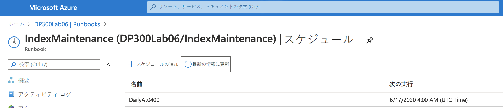
