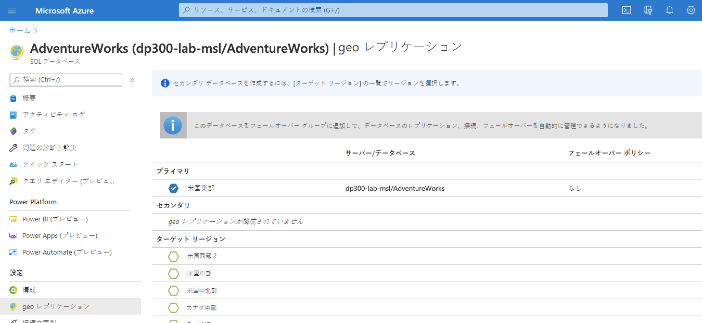
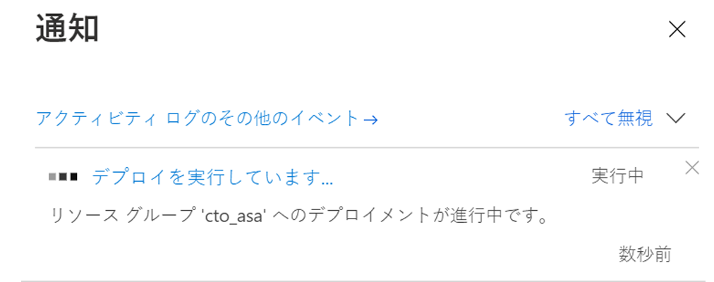
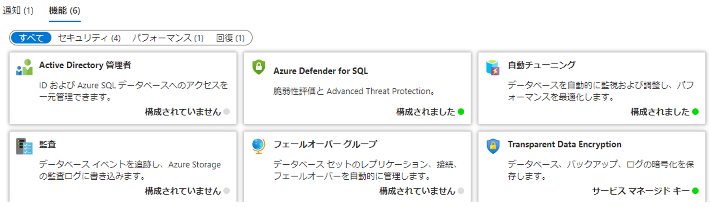

---
lab:
    title: 'ラボ 7 – 高可用性とディザスター リカバリー環境の計画と実装'
    module: '高可用性とディザスター リカバリー環境の計画と実行'
---

# ラボ 7 – 高可用性とディザスター リカバリー環境の計画と実装

**推定時間**: 90 分

**前提条件**: 演習 1 で使用した Azure SQL Database は、モジュール 3 のラボで作成されました。 

**ラボ ファイル**: このラボのファイルは、D:\Labfiles\High Availability フォルダーにあります。

# ラボの概要

受講生は 2 つの主要なタスクを実行します。Azure SQL Database を地理的に冗長化することと、Azure を使用する URL にバックアップして復元することです。 

# ラボの目的

このラボを終了すると、次のことができるようになります。

- Azure SQL Database の geo レプリケーションを有効にする

- URL を使用して SQL Server データベースをバックアップおよび復元する


# シナリオ

前のラボで日常的なタスクを自動化したので、シニア データ エンジニアとして、データベース環境の IaaS と PaaS の両方の構成の可用性を向上させる必要があります。次の目標が課せられています。

- Azure SQL Database の geo レプリケーションを有効にして、データベースの可用性を向上させます。

- データベースを AzureのURL にバックアップし、人為的エラーが発生した後に復元します。


# 演習 1: Azure SQL Database の geo レプリケーションを有効にする

推定時間: 45 分

概要

受講者は、モジュール 3 のラボで作成した Azure SQL Database の構成を変更して、高可用性を実現します。

シナリオ

WideWorldImporters 内の DBA として、Azure SQL Database の geo レプリケーションを有効にする方法を理解し、それが機能していることを確認し、ポータルを使用して別のリージョンに手動でフェールオーバーする方法を知っている必要があります。

前提条件

- 受講生用に作成された Azure アカウント – ログイン (電子メール) とパスワードを提供する必要があります

- Azure SQL Database サーバーと事前作成されたデータベース

 

1. ブラウザー ウィンドウから Azure portal にログインしていない場合は、提供された Azure 資格情報を使用してログインします。

2. 次に示すように、メニューから SQL データベースを選択します。

	

3. ラボ 3 で作成した Azure SQL Database をクリックします。次に例を示します。

	

 

4. データベースのブレードの 「データ管理」 で、「レプリケーション」 を選択します。 

	

	

5. 左上の 「レプリカの作成」 ボタンをクリックします。 

	

6. 「**サーバー**」 で 「**新規作成**」 を選択します。新しいサーバー ペインで、一意のサーバー名、有効な管理者ログイン、および安全なパスワードを入力し、ターゲット リージョンとして選択したリージョンを選択し、「**OK**」 をクリックしてサーバーを作成します。

7. 「geo レプリケーション」ブレードで、「**確認して作成**」をクリックしてから「**作成**」をクリックします。これで、セカンダリ サーバーとデータベースが作成されます。ステータスを確認するには、ポータル上部のベル アイコンの下を確認します。成功した場合、「デプロイ中」から「デプロイ成功」に進みます。

	

8. デプロイが完了したら、「**リソースに移動**」 を使用してデータベースのセカンダリ geo レプリケーションを表示します。「**概要**」 ページの下部にある 「**データベースの機能**」 セクションで、「**geo レプリケーション」** 設定はこのデータベースが**セカンダリ**であることを示していることに注意してください。

	

9. Azure SQL Database にレプリケーションが構成されたので、フェールオーバーを実行します。セカンダリ サーバーの 「**geo レプリケーション**」 ページを選択し、プライマリ サーバーとセカンダリ サーバーが示されていることに注意してください。

10. セカンダリ サーバーの 「...」 メニューを選択し、「**強制フェイルオーバー**」 をクリックします。

	

11. プロンプトが表示された場合は、「**はい**」 をクリックします。 

	プライマリ レプリカのステータスが 「保留中」、セカンダリ レプリカのステータスが 「フェールオーバー」に切り替わります。このプロセスには数分かかります。完了すると、ロールが切り替わり、セカンダリが新しいプライマリになり、古いプライマリがセカンダリになります。

# 演習 2: URL へのバックアップと URL からの復元

推定時間: 45 分

このエクササイズのタスクは次のとおりです。

- URL へのバックアップを構成する

- WideWorldImporters のバックアップ

- Restore WideWorldImporters

## タスク 1: URL へのバックアップを構成する

SQL Server のデータベースを Azure にバックアップする前に、いくつかの構成タスクを実行する必要があります。 

**注:** ストレージ アカウント キーや共有アクセス署名など、いくつかの長い文字列が生成されて再利用されます。これらの文字列を保持するために使用するために、ラボ VM 内でメモ帳ファイルを開くことを検討する必要があります。 

1. コンテキストが LON-SQL1 仮想マシンであることを確認します。

2. Edge を起動し、Azure portal ([https://portal.azure.com](https://portal.azure.com/))にログインします (既にアクセスしている場合を除く)。

3. 右上隅にある以下のアイコンを選択して、Cloud Shell プロンプトを開きます。

	

4. まだ Cloud Shell を使用していない場合は、ポータルの下半分に、Azure Cloud Shell へのウェルカム メッセージが表示される場合があります。Bash を選択します。

	

5. 以前に Cloud Shell を使用したことがない場合は、ストレージを提供する必要があります。下のダイアログで 「ストレージの作成」 をクリックします。

	


6. Cloud Shell をすでに使用している場合は、Cloud Shell 画面の左上隅に Bash が表示されていることを確認してください。ドロップ ダウン矢印を使用して、PowerShell または Bash を選択できます。 
 

	完了すると、以下のようなプロンプトが表示されます。

	


7. Cloud Shell で次のコマンドを実行して、CLI からストレージ アカウントを作成します。

	```
	az storage account create -n dp300storage -g DP-300-Lab02 --kind StorageV2 -l eastus2
	```

	コマンドを編集して、ストレージ アカウント名が一意で、すべて小文字で特殊文字がないようにします。上記の *dp300storage* を *dp300storagemsl123* のような一意の名前に変更する必要があります。値 *DP-300-Lab02* は、既存のリソース グループの名前です。以前のラボで作成したものを使用してください。必要に応じてリージョンを変更します。Enter キーを押してコマンドを実行します。 


	次に、自分のアカウントのアカウント キーを取得します。これは、以降の手順で使用します。前のコマンドで使用したのと同じ名前 (-n の後) とリソース グループ (-g の後) を使用するように編集した後、Cloud Shell で次のコードを実行します。

	```
	az storage account keys list -g DP-300-Lab02 -n dp300storage
	```

	アカウント キーは上記のコマンドの結果に含まれます。ここに示すように、key1 の戻り値 (二重引用符なし) を必ずコピーしてください。メモ帳に保存できます。 


	
 

8. SQL Server のデータベースを URL にバックアップするには、ストレージ アカウントとその中のコンテナーを使用します。この手順では、バックアップ ストレージ専用のコンテナーを作成します。これを行うには、次のコマンドを実行します。ここで、*dp300storage* はストレージ アカウントの作成時に使用されるストレージ アカウント名であり、*storage_key* は上記で生成されたキーです。

	```
	az storage container create --name "backups" --account-name "dp300storage" --account-key "storage_key" --fail-on-exist
	```
 
	出力は true を返すはずです。

	


9. コンテナーのバックアップが作成されたことをさらに確認するには、次の手順を実行します。ここで、*dp300storage* は作成したストレージ アカウント名で、*storage_key* は上記で生成したキーです。 

	```
	az storage container list --account-name "dp300storage" --account-key "storage_key"
	```

	出力の一部は以下のようなものを返すはずです。

	


10. セキュリティのために、コンテナー レベルの Shared Access Signature (SAS) が必要です。これは、Cloud Shell または PowerShell を介して生成できます。以下を実行します。ここで、*dp300storage* は上記で作成したストレージ アカウント名、*storage_key* は上記で生成されたキー、*date_in_the_future* は現在より後の時間です。date_in_the_future は UTC でなければなりません。例は 2020-10-31T00:00Z で、2020 年 5 月 31 日の午前 0 時に期限切れになります。

	```
	az storage container generate-sas -n "backups" --account-name "dp300storage" --account-key "storage_key" --permissions "rwdl" --expiry "date_in_the_future" -o tsv
	```
	**注: 有効期限の形式は "YYYY-MM-DD" です。ここで YYYY は 4 桁の年、MM は 2 桁の月、DD は 2 桁の日です。**

	出力は、次のタスクで使用される以下に示す値のようなものを返すはずです。以前に保存したキーと一緒にメモ帳に値をコピーして保存できます。 

	


## タスク 2: WideWorldImporters のバックアップ

これで機能が構成されたので、Azure で BLOB としてバックアップ ファイルを生成できます。 

1. SQL Server Management Studio を開き、LON-SQL1 に接続していることを確認します。

2. 「新しいクエリ」 をクリックします。

3. 次の Transact-SQL を使用して、クラウド内のストレージにアクセスするために使用される資格情報を作成します。(資格情報がすでに存在する場合は、最初に削除します。)適切な値を入力します。ここで、*dp300storage* はタスク 1、ステップ 8 で作成されたストレージ アカウント名であり、sas_token はタスク 1、ステップ 10 で生成された値です (*se=...* で始まります)。 

	```sql
	IF EXISTS 

	(SELECT * FROM sys.credentials 

	WHERE name = 'https://dp300storage.blob.core.windows.net/backups') 

	BEGIN
	
	    DROP CREDENTIAL [https://dp300storage.blob.core.windows.net/backups]
	    
	END
	
	GO


	CREATE CREDENTIAL [https://dp300storage.blob.core.windows.net/backups]

	WITH IDENTITY = 'SHARED ACCESS SIGNATURE',

	SECRET = 'sas_token'

	GO 
	```
	

4. 「**実行**」 をクリックします。これは成功するはずです。

5. Transact-SQL で次のコマンドを使用して、データベース WideWorldImporters を Azure にバックアップします。*dp300storage* は、タスク 1 で使用されるストレージ アカウント名です。

	```sql
	BACKUP DATABASE WideWorldImporters 

	TO URL = 'https://dp300storage.blob.core.windows.net/backups/WideWorldImporters.bak';

	GO 
	```

	これには時間がかかる場合があります。成功すると、次のようなメッセージが表示されます。

	データベース「WideWorldImporters」、ファイル「WWI_Primary」の 1240 ページをファイル 1 で処理しました

	ファイル 1 のデータベース「WideWorldImporters」、ファイル「WWI_UserData」の 53104 ページを処理しました

	データベース「WideWorldImporters」、ファイル1のファイル「WWI_InMemory_Data_1」の 3865 ページを処理しました

	データベース「WideWorldImporters」、ファイル1のファイル「WWI_Log」の 1468 ページを処理しました。

	BACKUP DATABASE は 14.839 秒 (31.419 MB/秒) で 59677 ページを正常に処理しました。

	Completion time: 2020-05-18T08:01:41.6935863+00:00

	

	何かが正しく構成されていない場合は、次のようなエラー メッセージが表示されます。

	メッセージ 3201、レベル 16、状態 1、行 33  
	バックアップ デバイス 'https://dp300storage.blob.core.windows.net/container_name/WideWorldImporters.bak' を開けません。オペレーティング システム エラー 50 (要求はサポートされていません。)。  
	Msg 3013, Level 16, State 1, Line 33  
	BACKUP DATABASE が異常終了しています。


	入力ミスがないこと、すべてが正常に作成されていることを確認してください。

6. ファイルが実際に Azure にあることを確認するには、Storage Explorer または Azure Cloud Shell を使用できます。Bash の構文は次のとおりです。ここで、*dp300storage* はタスク 1 で使用されるストレージ アカウント名であり、*account_key* はそこでも使用されるキーです。 
	```
	az storage blob list -c "backups" --account-name "dp300storage" --account-key "storage_key"
	```
	
	出力例を以下に示します。

	

 
## タスク 3: Restore WideWorldImporters

このタスクでは、データベースを復元する方法を示します。


1. SQL Server Management Studio の 「新しいクエリ」 ウィンドウで、次のコマンドを実行します 
	```sql
	USE WideWorldImporters;
	GO
	
	```

2. 次のステートメントを実行して、CustomerID が 1 の Customers テーブルの最初の行を返します。顧客の名前を書き留めます。
	```sql
	SELECT TOP 1 * FROM Sales.Customers;
	GO
	
	```
	
3. このコマンドを実行して、その顧客の名前を変更します。
	```sql
	UPDATE Sales.Customers
	SET CustomerName = 'This is a human error'
	WHERE CustomerID = 1;
	GO
	
	```

4. 手順 2 を再実行して、名前が変更されたことを確認します。ここで、誰かが WHERE 句なしで数千または数百万の行を変更したか、間違った WHERE 句があるかを想像してください。

5. データベースを復元して、手順 3 で行った変更前の状態に戻すには、現在 **WideWorldImporters** データベースに接続されているクエリをすべて閉じてから、次の手順を実行します。ここで、*dp300storage* はタスク 1 で使用されるストレージ アカウント名です。

	```sql
	USE master;
	GO

	RESTORE DATABASE WideWorldImporters 
	FROM URL = 'https://dp300storage.blob.core.windows.net/backups/WideWorldImporters.bak';
	GO
	```

	これには時間がかかる場合があります。出力は次のようになります。

	データベース「WideWorldImporters」、ファイル「WWI_Primary」の 1240 ページをファイル 1 で処理しました

	ファイル 1 のデータベース「WideWorldImporters」、ファイル「WWI_UserData」の 53104 ページを処理しました

	データベース「WideWorldImporters」、ファイル1のファイル「WWI_Log」の 1468 ページを処理しました。

	データベース「WideWorldImporters」、ファイル1のファイル「WWI_InMemory_Data_1」の 3865 ページを処理しました

	RESTORE DATABASE は、59,677 ページを 16.167 秒 (28.838 MB/秒) で正常に処理しました。

	Completion time: 2020-05-18T08:35:06.6344123+00:00

6. WideWorldImporters の復元が完了したら、手順 1 と 2 を再実行します。データは元の状態に戻ります。
