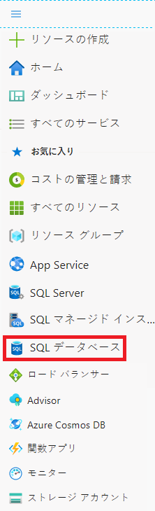
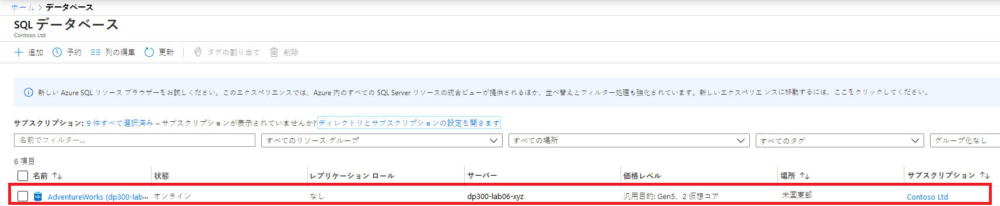
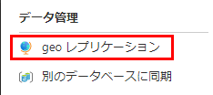
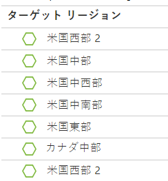
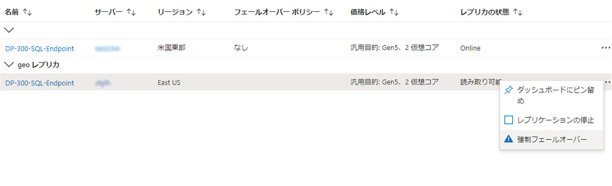
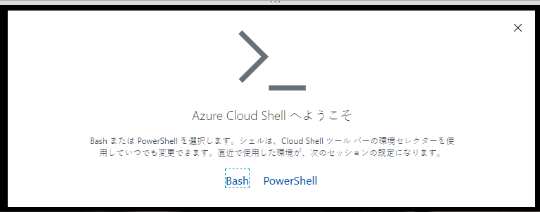
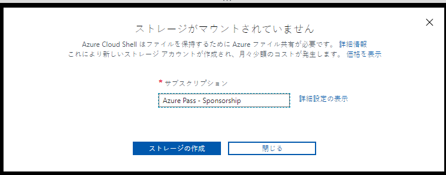

---
lab:
  title: ラボ 7 – 高可用性とディザスター リカバリー環境の計画と実装
  module: Planning and Implementing a High Availability and Disaster Recovery Environment
---

# <a name="lab-7--planning-and-implementing-a-high-availability-and-disaster-recovery-environment"></a>ラボ 7 – 高可用性とディザスター リカバリー環境の計画と実装

**推定時間**:90 分

**前提条件**:演習 1 で使用した Azure SQL Database は、モジュール 3 のラボで作成されました。 

**ラボ ファイル**：このラボのファイルは、D:\Labfiles\High Availability フォルダーにあります。

# <a name="lab-overview"></a>ラボの概要

受講者は 2 つの主要なタスクを実行します。Azure SQL Database を地理的に冗長化することと、Azure を使用する URL にバックアップして復元することです。 

# <a name="lab-objectives"></a>ラボの目的

このラボを完了すると、次のことができるようになります。

- Azure SQL Database の geo レプリケーションを有効にする

- URL を使用して SQL Server データベースをバックアップおよび復元する


# <a name="scenario"></a>シナリオ

Now that you have automated day-to-day tasks in the previous lab, as the Senior Data Engineer, you are tasked with improving the availability of both IaaS and PaaS configurations for your database environment. You are tasked with the following objectives:

- Azure SQL Database の geo レプリケーションを有効にして、データベースの可用性を向上させます。

- データベースを AzureのURL にバックアップし、人為的エラーが発生した後に復元します。


# <a name="exercise-1-enable-geo-replication-for-azure-sql-database"></a>演習 1:Azure SQL Database の geo レプリケーションを有効にする

予測される所要時間:45 分

概要

受講者は、モジュール 3 のラボで作成した Azure SQL Database の構成を変更して、高可用性を実現します。

シナリオ

WideWorldImporters 内の DBA として、Azure SQL Database の geo レプリケーションを有効にする方法を理解し、それが機能していることを確認し、ポータルを使用して別のリージョンに手動でフェールオーバーする方法を知っている必要があります。

前提条件

- 受講生用に作成された Azure アカウント – ログイン (電子メール) とパスワードを提供する必要があります

- Azure SQL Database サーバーと事前作成されたデータベース

 

1. ブラウザー ウィンドウから Azure portal にログインしていない場合は、提供された Azure 資格情報を使用してログインします。

2. 次に示すように、メニューから SQL データベースを選択します。

    

3. Click on the Azure SQL Database that was created in Lab 3. An example is shown below.

    

4. データベースのブレードの [データ管理] で、 **[レプリカ]** を選択します。

    

5. 次に、左上の **[レプリカの作成]** ボタンをクリックします。

    

6. Under <bpt id="p1">**</bpt>Server<ept id="p1">**</ept>, select <bpt id="p2">**</bpt>Create New<ept id="p2">**</ept>. On the new server pane, enter a unique server name, a valid admin login, and a secure password, and select the region you chose as the target region and then click <bpt id="p1">**</bpt>OK<ept id="p1">**</ept> to create the server.

7. Back in the Geo-Replica blade, click <bpt id="p1">**</bpt>Review + Create<ept id="p1">**</ept>, and then click <bpt id="p2">**</bpt>Create<ept id="p2">**</ept>. The secondary server and the database will now be created. To check the status, look under the bell icon at the top of the portal. If successful, it will progress from Deployment in progress to Deployment succeeded.

8. Now that the Azure SQL Database is configured with replicas, you will perform a failover. Select the <bpt id="p1">**</bpt>Replicas<ept id="p1">**</ept> page for the secondary server and note that the primary and secondary servers are indicated.

9. セカンダリ サーバーの **[...]** メニューを選択し、 **[強制フェールオーバー]** をクリックします。

    

10. メッセージが表示されたら、**[はい]** をクリックします。 

    The status of the primary replica will switch to Pending and the secondary, Failover. The process will take a few minutes. When complete, the roles will switch with the secondary becoming the new primary and the old primary becoming the secondary.

# <a name="exercise-2-backup-to-url-and-restore-from-url"></a>演習 2:URL へのバックアップと URL からの復元

予測される所要時間:45 分

このエクササイズのタスクは次のとおりです。

- URL へのバックアップを構成する

- WideWorldImporters のバックアップ

- WideWorldImporters を復元する

## <a name="task-1-configure-backup-to-url"></a>タスク 1:URL へのバックアップを構成する

SQL Server のデータベースを Azure にバックアップする前に、いくつかの構成タスクを実行する必要があります。 

<bpt id="p1">**</bpt>Note:<ept id="p1">**</ept> There are several long strings, including storage account keys and shared access signatures, that are generated and then reused. You should consider opening up a Notepad file within the lab VM to use for holding these strings. 

1. コンテキストが LON-SQL1 仮想マシンであることを確認します。

2. Edge を起動し、Azure portal ([https://portal.azure.com](https://portal.azure.com/)) にログインします (既にアクセスしている場合を除く)。

3. 右上隅にある以下のアイコンを選択して、Cloud Shell プロンプトを開きます。

    

4. At the bottom half of the portal, you may see a message welcoming you to Azure Cloud Shell, if you have not yet used Cloud Shell. Select Bash.

    

5. If you have not previously used Cloud Shell, you must give it storage. Click Create Storage in the dialog below.

    


6. If you have already used Cloud Shell, just make sure the upper left corner of the Cloud shell screen shows Bash. You can use the drop down arrow to select either PowerShell or Bash. 
 

    完了すると、下のようなプロンプトが表示されます。

    


7. Cloud Shell で次のコマンドを実行して、CLI からストレージ アカウントを作成します。

    ```
    az storage account create -n dp300storage -g DP-300-Lab02 --kind StorageV2 -l eastus2
    ```

    Edit the command so that your storage account name is unique and all lower case with no special characters. You should change <bpt id="p1">*</bpt>dp300storage<ept id="p1">*</ept> in the above to a unique name like <bpt id="p2">*</bpt>dp300storagemsl123<ept id="p2">*</ept>. The value <bpt id="p1">*</bpt>DP-300-Lab02<ept id="p1">*</ept> is the name of an existing Resource Group. Make sure you use one that has been created in an earlier lab. Change the region if desired. Press Enter to run the command. 


    Next you will get the account keys for your account, which you will use in subsequent steps. Execute the following code in cloud shell, after editing to use the same name (after the -n) and resource group (after the -g) that you used in the previous command.

    ```
    az storage account keys list -g DP-300-Lab02 -n dp300storage
    ```

    Your account key will be in the results of the above command. Make sure you  Copy the returned value for key1 (without the double quotes) as shown here. You might save it in Notepad. 


    
 

8. 前のラボで日常的なタスクを自動化したので、シニア データ エンジニアとして、データベース環境の IaaS と PaaS の両方の構成の可用性を向上させる必要があります。

    ```
    az storage container create --name "backups" --account-name "dp300storage" --account-key "storage_key" --fail-on-exist
    ```
 
    出力は true を返します。

    


9. コンテナーのバックアップが作成されたことをさらに確認するには、次の手順を実行します。ここで、*dp300storage* は作成したストレージ アカウント名で、*storage_key* は上記で生成したキーです。 

    ```
    az storage container list --account-name "dp300storage" --account-key "storage_key"
    ```

    出力の一部は以下のようなものを返すはずです。

    


10. 次の目標が課せられています。

    ```
    az storage container generate-sas -n "backups" --account-name "dp300storage" --account-key "storage_key" --permissions "rwdl" --expiry "date_in_the_future" -o tsv
    ```
    **注:有効期限の形式は "YYYY-MM-DD" です。ここで YYYY は 4 桁の年、MM は 2 桁の月、DD は 2 桁の日です。**

    The output should return something similar to the value shown below which will be used in the next Task. You can copy and save the value in Notepad along with the key you saved earlier. 

    


## <a name="task-2-back-up-wideworldimporters"></a>タスク 2:WideWorldImporters をバックアップする

機能が構成されたので、Azure でバックアップ ファイルを BLOB として生成できます。 

1. SQL Server Management Studio を開き、LON-SQL1 に接続していることを確認します。

2. [新しいクエリ] をクリックします。

3. Create the credential that will be used to access storage in the cloud with the following Transact-SQL. (If a credential already exists, drop it first.) Fill in the appropriate values, where <bpt id="p1">*</bpt>dp300storage<ept id="p1">*</ept> is the storage account name created in Task 1, Step 8 and <bpt id="p2">*</bpt>sas_token<ept id="p2">*</ept> is the value generated in Task 1, Step 10 (starting with <bpt id="p3">*</bpt>se=...<ept id="p3">*</ept>). 

    ```sql
    IF EXISTS 

    (SELECT * FROM sys.credentials 

    WHERE name = 'https://dp300storage.blob.core.windows.net/backups') 

    BEGIN
    
        DROP CREDENTIAL [https://dp300storage.blob.core.windows.net/backups]
        
    END
    
    GO


    CREATE CREDENTIAL [https://dp300storage.blob.core.windows.net/backups]

    WITH IDENTITY = 'SHARED ACCESS SIGNATURE',

    SECRET = 'sas_token'

    GO 
    ```
    

4. Click <bpt id="p1">**</bpt>Execute<ept id="p1">**</ept>. This should be successful.

5. Transact-SQL で次のコマンドを使用して、データベース WideWorldImporters を Azure にバックアップします。*dp300storage* は、タスク 1 で使用されるストレージ アカウント名です。

    ```sql
    BACKUP DATABASE WideWorldImporters 

    TO URL = 'https://dp300storage.blob.core.windows.net/backups/WideWorldImporters.bak';

    GO 
    ```

    This may take some time. If successful, you should see output similar to this:

    データベース 'WideWorldImporters'、ファイル 'WWI_Primary' の 1240 ページをファイル 1 で処理しました。

    ファイル 1 のデータベース 'WideWorldImporters'、ファイル 'WWI_UserData' の 53104 ページを処理しました。

    データベース 'WideWorldImporters'、ファイル 1 のファイル 'WWI_InMemory_Data_1' の 3865 ページを処理しました

    データベース 'WideWorldImporters'、ファイル 1 のファイル 'WWI_Log' の 1468 ページを処理しました。

    BACKUP DATABASE は 14.839 秒 (31.419 MB/秒) で 59677 ページを正常に処理しました。

    完了時間:2020-05-18T08:01:41.6935863+00:00

    

    何かが正しく構成されていない場合は、次のようなエラー メッセージが表示されます。

    メッセージ 3201、レベル 16、状態 1、行 33  
    ‎Cannot open backup device '<ph id="ph1">https://dp300storage.blob.core.windows.net/container_name/WideWorldImporters.bak</ph>'. Operating system error 50(The request is not supported.).  
    Msg 3013, Level 16, State 1, Line 33  
    BACKUP DATABASE が異常終了しています。


    入力ミスがないこと、すべてが正常に作成されていることを確認してください。

6. To see that the file is actually in Azure, you can use Storage Explorer or Azure Cloud Shell. The syntax in Bash is as follows, where <bpt id="p1">*</bpt>dp300storage<ept id="p1">*</ept> is the storage account name used in Task 1, and <bpt id="p2">*</bpt>account_key<ept id="p2">*</ept> is the key used there as well. 
    ```
    az storage blob list -c "backups" --account-name "dp300storage" --account-key "storage_key"
    ```
    
    出力例を以下に示します。

    

 
## <a name="task-3-restore-wideworldimporters"></a>タスク 3:WideWorldImporters を復元する

このタスクでは、データベースを復元する方法について説明します。


1. SQL Server Management Studio の [新しいクエリ] ウィンドウで、次のコマンドを実行します 
    ```sql
    USE WideWorldImporters;
    GO
    
    ```

2. Now execute the statement below to return the very first row of the Customers table which has a CustomerID of 1. Note the name of the customer.
    ```sql
    SELECT TOP 1 * FROM Sales.Customers;
    GO
    
    ```
    
3. こちらのコマンドを実行して、その顧客の名前を変更します。
    ```sql
    UPDATE Sales.Customers
    SET CustomerName = 'This is a human error'
    WHERE CustomerID = 1;
    GO
    
    ```

4. Re-run Step 2 to verify that the name has been changed. Now imagine if someone had changed thousands or millions of rows without a WHERE clause – or the wrong WHERE clause.

5. データベースを復元して、手順 3 で行った変更前の状態に戻すには、現在 **WideWorldImporters** データベースに接続されているクエリをすべて閉じてから、次の手順を実行します。ここで、*dp300storage* はタスク 1 で使用されるストレージ アカウント名です。

    ```sql
    USE master;
    GO

    RESTORE DATABASE WideWorldImporters 
    FROM URL = 'https://dp300storage.blob.core.windows.net/backups/WideWorldImporters.bak';
    GO
    ```

    This may take some time. The output should be similar to this:

    データベース 'WideWorldImporters'、ファイル 'WWI_Primary' の 1240 ページをファイル 1 で処理しました。

    ファイル 1 のデータベース 'WideWorldImporters'、ファイル 'WWI_UserData' の 53104 ページを処理しました。

    データベース 'WideWorldImporters'、ファイル 1 のファイル 'WWI_Log' の 1468 ページを処理しました。

    データベース 'WideWorldImporters'、ファイル 1 のファイル 'WWI_InMemory_Data_1' の 3865 ページを処理しました

    RESTORE DATABASE は、59,677 ページを 16.167 秒 (28.838 MB/秒) で正常に処理しました。

    完了時間:5/18/2020 8:35:06 AM

6. When the restore of WideWorldImporters is finished, re-run Steps 1 and 2. The data will be back to what it was.
